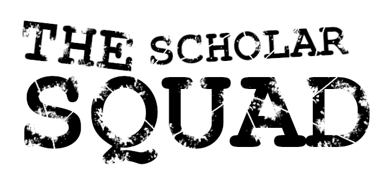

# Uczenie Maszynowe - Teoria

### Autorzy

The Scholar Squad

### Abstrakt

Przygotujcie się na niezapomnianą przygodę z kursem z uczenia maszynowego.
Kurs ten zabierze Was w podróż po klasycznych algorytmach uczenia maszynowego,
które potrafią zrobić niesamowite rzeczy, takie jak regresja, klasyfikacja, klastrowanie, 
redukcja wymiarów i wyszukiwanie wzorców. Poznacie również tajemnice sieci neuronowych i ich różnorodne typy.
Kurs ten uświadomi Wam również podstawowe problemy, które mogą Wam się nawarzyć podczas uczenia maszynowego i oświeci ich matematyczne źródła.
Będziecie w stanie wybrać odpowiedni algorytm uczenia maszynowego w zależności od konkretnego zadania i dostępnych danych.
Ponadto, kurs ten obejmuje tematy związane z walidacją modelu i rozwiązywaniem typowych kłopotów, które mogą Wam się przyplątać podczas trenowania modelu.
Zdobędziecie umiejętność przeprowadzania walidacji modelu oraz rozwiązywania występujących bolączek.

[Przeczytaj cały dokument](/ml-teoria.pdf)
