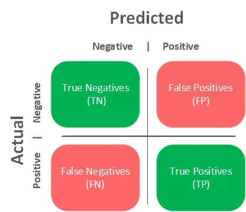
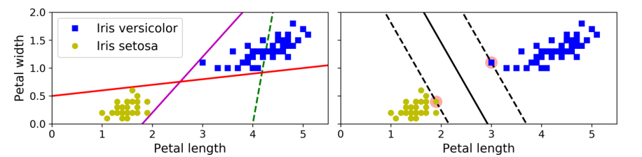
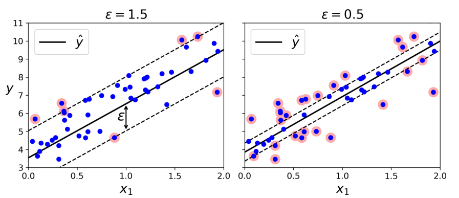
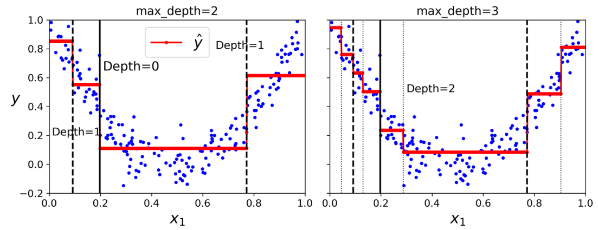

# Rodzaje uczenia maszynowego

Podziały ze względu na:
* nadzór:
  * **uczenie nadzorowane** - trzeba etykietować zbiór uczący
  * **uczenie nienadzorowane** - nie trzeba etykietować zbioru uczącego (uczenie bez nauczyciela)
  * **częściowo nadzorowane** - część danych jest etykietowana, część nie
  * **uczenie przez wzmacnianie** - polega na dawaniu kar i nagród za konkretne wybory, które algorytm uwzględnia przy kolejnych próbach 
* sposób uogólnienia:
  * **instancje (np. KNN, drzewa)** - uczenie na pamięć, szuka najbardziej podobnego do pytanego obiektu i podpisuje go tak samo według poznanych zasad, przykład: K-nearest neighbors; przede wszystkim wielkość modelu jest nieznana przed rozpoczęciem uczenia
  * **model (np. sieci neuronowe, regresja logistyczna, SVM)** - szuka zależności między wartościami i na ich podstawie dobiera parametry funkcji, na podstawie której potem przewiduje wartość; wielkość modelu jest znana przed rozpoczęciem uczenia
* dostęp do danych:
  * **batch** - posiadamy dostęp do kompletnego zbioru danych, jeśli możemy trzymać cały zbiór danych i dane nie zmieniają się zbyt często
  * **online (mini-batches)** - karmimy model ciągle małymi porcjami danych, jeśli nie mamy miejsca na utrzymanie całego zbioru lub dane ciągle się zmieniają

# Metryki

## ***Klasyfikacja***

* Confusion Matrix 

{ width=60% }

    
    
### Accuracy

$$ Accuracy = \frac{TP + TN}{TP + TN + FP + FN} $$

* Classification Error
  * Wyraża jaka część instancji została dobrze sklasyfikowana

### Precision

$$ Precission = \frac{TP}{TP + FP} $$

* Stosowana gdy wymagamy od modelu wysoką wartość *True Positives* i chcemy zminimalizować liczbę *False Positives*
* Proporcja *True Positives* do *sumy True Positives i False Positives* 

### Recall (True Positive Rate, Sensitivity, Probability of Detection)

$$ Recall = \frac{TP}{TP + FN} $$

* Stosowana gdy wymagamy od modelu wysoką wartość *True Positives* i chcemy zminimalizować liczbę *False Negatives*
* Proporcja *True Positives* do *sumy True Positives i False Negatives*

### F1-score

$$ F1-score = \frac{2}{\frac{1}{Precision} + \frac{1}{Recall}} $$

* Metryka stosowana do porównywania modeli.
* Korzystne dla modeli z podobną wartością *Precision* i *Recall*.
* Średnia harmoniczna obu wartości.

### Kompromis Precision/Recall 

* *Precision* zmniejsza *Recall* i vice versa.
  
## ***Regresja***

Mean square error (błąd średnio kwadratowy):

$$ MSE(x, y) = \frac{1}{n} \sum_{i=1}^{n}{(f(x_{i}) - y_{i})^2} $$

* Błąd średnio-kwadratowy, najczęściej stosowany w przypadku regresji liniowej
* Stosowana ogólnie w regresjach
* Gdy funkcja f jest różniczkowalna, to MSE jest różniczkowalny ze względu na parametry funkcji f
* Równoważna z normą $l_2$ (Norma Euklidesowa)

Mean absolute error (błąd średnio bezwzględny):

$$ MAE(x, y) = \frac{1}{n} \sum_{i=1}^{n}{|f(x_{i}) - y_{i}|} $$

* Błąd średniego odchylenia wartości bezwzględnej
* Stosowana ogólnie w regres
* Stosowane gdy jest dużo *outlier'ów* w zbiorze
* Równoważna z normą $l_1$ (Norma Manhattan) 

Entropia:

$$ H(X) = -\sum_{i=1}^{n}{p(x_{i}) \log{p(x_{i})}} $$

* Wyraża ilość informacji, którą możemy uzyskać po otrzymaniu instancji ze zbioru
* Tworzy zbilansowane drzewa
* Tak dzielimy zbiór tworząc drzewa, aby zysk entropii był jak największy (dowiadujemy się najwięcej dzieląc w ten sposób)

Gini:

$$ Gini(X) = 1 -\sum_{i=1}^{n}{p(x_{i})^2} $$

* Wyraża czystość zbioru
* Szybsza do obliczenia (względem entropii, nie trzeba liczyć logarytmu)
* Ma tendencję do izolowania najczęściej występującej klasy w osobnej gałęzi drzewa. 
* Jest zerowa gdy wszystkie instancje w zbiorze są tej samej klasy
* Jest maksymalna gdy instancje są równomiernie rozłożone po klasach
* Wykorzystywana w algorytmie *CART* (Classification and Regression Tree).

Entropia krzyżowa:

$$ H(p, q) = -\sum_{i=1}^{n}{p(x_{i}) \log{q(x_{i})}} $$

* Stosowana w klasyfikacji
* Wyraża oczekiwaną ilość informacji o instancji, jeżeli zakodujemy ją przy użyciu modelu $q$ zamiast $p$
* $p(x_{i})$ - prawdziwy rozkład prawdopodobieństwa
* $q(x_{i})$ - rozkład prawdopodobieństwa przewidywany przez model
* Podczas uczenia modelu $q$ staramy się minimalizować entropię krzyżową, ponieważ to oznacza, że potrzebujemy mniejszej liczby bitów, żeby przewidzieć klasę instancji z rozkładu $p$ (dla rozkładu $p$ podczas uczenia zazwyczaj dokładnie znamy klasy każdej z instancji, więc entropia rozkładu $p$ jest równa 0).

# Regresja

## Regresja Liniowa

* Opiera się na założeniu, że istnieje liniowa zależność między zmiennymi wejściowymi a zmienną wyjściową.
* Dopasowuje hiperpłaszczyznę (określoną funkcją $g$), dla której średnia odległość instancji od wartości funkcji $g$ jest najmniejsza.
* Mamy zbiór wektorów $A \subseteq \mathbb{R^{n + 1}}$ i funkcję $f: A \rightarrow \mathbb{R}$, która przyporządkowuje każdemu wektorowi $x \in A$ wartość $f(x)$
* Każdy wektor ze zbioru $A$ ma postać $x = [x_0, x_1, ..., x_n]$, gdzie $x_0 = 1$
* Chcemy znaleźć funkcję $g: \mathbb{R}^{n + 1} \rightarrow \mathbb{R}$ taką, że $g(x)=\Theta^Tx$ dla pewnego wektora $\Theta \in \mathbb{R}^n$ i wektor $\Theta$ minimalizuje $MSE(x, \Theta) = \frac{1}{n} \sum_{i=1}{n}{(\Theta^Tx - f(x))^2}$
* Można pokazać, że jeżeli mamy wektor $z$ wszystkich wartości $f(x)$ dla wszystkich wektorów ze zbioru $A$ oraz $X$ jest macierzą złożoną ze wszystkich wektorów z A, to $\Theta=(X^TX)^{-1}X^T$

## Gradient Descent

* Stosowany jeżeli nie można znaleźć rozwiązania analitycznego (np. w przypadku regresji logistycznej), a rozważana funkcja jest ciągła i różniczkowalna w rozważanej dziedzinie
* Zaczynamy ze startowym wektorem x z dziedziny analizowanej funkcji
* Obliczamy gradient funkcji w punkcie x
* Przesuwamy się w kierunku przeciwnym do wektora gradientu, ponieważ gwarantuje to najszybsze możliwe zmniejszanie się wartości funkcji
* Znajduje minimum lokalne.

Stochastic Gradient Descent:
* Stosowany w przypadku, gdy zbiór danych jest bardzo duży
* Do obliczania gradientu wybieramy losowo podzbiór danych
* Znajduje minimum lokalne, szybciej niż *Gradient Descent*, ale nie jest tak dokładny.

## Regresja wielomianowa

* Regresja liniowa, ale zamiast liniowej funkcji $g$ używamy wielomianu $g$ stopnia $n$
* Do każdej instancji $x$ dodajemy nowe cechy $x_2 = x^2, x_3 = x^3, ..., x_n = x^n$, następnie stosujemy regresję liniową na nowym zbiorze cech.

## Learning Curves

### Bias

* Błąd generalizacji wynikający ze złych założeń. Prowadzi do *underfittingu*
* Model jest najprawodopodobniej zbyt prosty.

### Variance

* Nadmierna wrażliwość na małą wariancję w zbiorze danych. Prowadzi do *underfittingu*
* Model jest najprawodopodobniej zbyt skomplikowany.

### Irreducible Error

* Wynika z zaszumionego zbioru danych.
  
### Kompromis między *Bias* a *Variance*

* Zwiększenie złożoności modelu prowadzi do zwiększenia *Variance* i zmniejszenia *Bias'u* i vice versa.

---

## Regularyzowane modele liniowe

### Ridge Regression

* Regularyzowana wersja *Regresji Liniowej*
* Zmusza model do utrzymywania małych wag
* Używa normy $l_2$

### Lasso Regression

* Regularyzowana wersja *Regresji Liniowej*
* Używa normy $l_1$
* Ma tendencje do usuwania wag dla najmniej ważnych cech
* Zwraca *Rzadki model* (Dużo zer w polach wag)

### Early Stopping

* Zatrzymuje proces uczenia w momencie gdy *błąd walidacji* osiąga minimum.

---

## Regresja Logistyczna
* Wykorzystuj funkcję aktywacji $f(x) = \frac{1}{1+e^{-x}}$ (Sigmoid)
* Szacuje prawdopodobieństwo przynależności instancji do pewnej klasy.
* Stosuje funkcji *sigmoid* do zwrócenia prawdopodobieństwa (Sigmoid zwraca wartości między 0 a 1).

# SVM (Support Vector Machines)

* Algorytm klasyfikacji oparty o zasadę największego marginesu. 
  
  

* Wrażliwy na skalowanie danych (Zawsze skalować przed użyciem)
* 
## Hard Margin Classification

* Wszystkie instancje muszą się znaleźć poza marginesem.
* Działa tylko wtedy, gdy dane da się liniowo rozdzielić.
* Wrażliwy na *outliers'y*

## Soft Margin Classification

* Elastyczny model
* Szyka balansu między posiadaniem jak największego marginesu, a limitowaniem liczby jego naruszeń.

## Nieliniowa klasyfikacja SVM

* Używaj kiedy dane nie da się rozdzielić liniowo.

### Polynomial Kernel

* Sztuczka dzięki której możemy dostać wyniki, jakbyśmy korzystali z wielomianowego modelu bez użycia go.

## Regresor SVM

* By działał musimy odwrócić jego zadanie- zmieścić jak najwięcej instancji w jak najmniejszym marginesie.
  

* Model jest $\epsilon$ niewrażliwy, czyli dodawanie więcej instancji znajdujących się w marginesie nie wpływa na zdolność przewidywania modelu.
* Do rozwiązywania nieliniowych modeli użyj **kernelized SVM model**

## Drzewa Decyzyjne

* Stosowany do klasyfikacji i regresji
* Nie wymaga przygotowania danych, nie trzeba skalować ani centrować
* **Model Nieparametryczny**
  * Liczba parametrów nie jest zdefiniowana przed ćwiczeniem modelu
  * Model może się przeuczyć.
* **White Box model**
  * Prosty do zinterpretowania- wiemy dlaczego podjął taką a nie inną decyzję.
* Scikit używa algorytmu **CART** (próbuje zachłannie minimalizować współczynnik Gini) do trenowania drzew decyzyjnych
* Algorytm **CART** w celu ustalenia miejsca podziału oblicza wartość \
$J(k, t_k) = \frac{m_{lewa}}{m} * G_{lewa} + \frac{m_{prawa}}{m} * G_{prawa}$, gdzie $G_{lewa}$ i $G_{prawa}$ wyrażają nieczystości lewej i prawej części po podziale, a $m_{lewa}$ i $m_{prawa}$ to liczba instancji w lewej i prawej części, $m$ to liczba wszystkich instancji
* Obrót przestrzeni instancji może całkowicie zmieniać wygenerowane drzewo i jego złożoność.

### White Box vs Black Box

* W przypadku *Black Box* ciężko jest sprawdzić dlaczego dany model podjął taką decyzję
* Dla modeli, które nie są *White Box* bardzo trudnym zadaniem jest dokładne określenie wnioskowania przeprowadzonego przez model, które może być łatwo zrozumiane przez człowieka0
* Przykłady *White Box*:
  * Drzewa decyzyjne
  * Regresja Liniowa
  * SVM
* Przykłady *Black Box*:
  * Sieci neuronowe
  * Random Forests

### Hiperparametry

* Bez żadnych ograniczeń model bardzo szybko przeucza się (Wtedy go nazywamy nieparametrycznym, opisany wyżej)
* ***Regularyzacja*** jest procesem mającym przeciwdziałać przeuczeniu, przez dobranie odpowiednich hiperparametrów
  * Najważniejszą wartość jaką możemy dostrajać jest ograniczenie maksymalnej *głębokości drzewa* (Domyślnie jest $\infty$)

### Regresja

* Struktura drzewa przypomina tą z problemu klasyfikacji.
* Możemy uznać problem regresji jako problem klasyfikacji z nieograniczoną liczbą klas, którą możemy regulować przez maksymalną głębokość drzewa.

# Ensemble Learning i Random Forests

* Stosujemy zasadę *mądrości tłumu* - jeżeli mamy wiele klasyfikatorów, to możemy je zagregować w grupę klasyfikatorów znacznie zwiększając wydajność modelu.
* Wszystkie klasyfikatory powinny być od siebie niezależne
* Redukuje *Bias* i *Variance*

## W problemie klasyfikacji rozróżniamy 2 rodzaje klasyfikatorów:

Wykorzystywana jest moc przyjaźni (ang. *Power of friendship*).

### *Hard Voting Classifier*

* Wybiera klasę, która jest dominantą zbioru propozycji klas zwróconych przez klasyfikatory.

### *Soft Voting Classifier*

* Wykorzystuje prawdopodobieństwa zwracane przez model, następnie uśrednia je i wybiera klasę z najwyższym średnim prawdopodobieństwem.

## Bagging i Pasting

* Wykorzystują wiele instancji klasyfikatora tego samego typu, ale trenowanych na różnych podzbiorach danych.

* **Bagging** (Bootstrap Aggregating) polega na losowaniu instancji ze zwracaniem (zastępowaniem) i trenowaniu na nich różnych klasyfikatorów, a następnie wykorzystaniu metody *hard voting* do wyboru klasy.
* **Pasting** jest podobny do *Bagging'u*, ale zamiast losować instancje ze zwracaniem, losuje je bez zwracania, co oznacza, że każdy klasyfikator może być trenowany tylko na części danych, a liczba klasyfikatorów jest ograniczona przez liczbę instancji w zbiorze treningowym.

## Random Forests

* Zbiór drzew decyzyjnych
* Dodaje extra losowość
* Umożliwia łatwe sprawdzenie istotności pewnej cechy
* Jeżeli zastosujemy *Bagging* na drzewach decyzyjnych, to otrzymamy *Random Forest*
* Agreguje predykcje ze wszystkich drzew i wybiera klasę o największej ilości głosów (hardvoting)
  * Grupa drzew decyzyjnych
  * Każdy uczy się na innym podzbiorze zbioru danych

### Extremely Randomized Trees Ensembly

* Szybciej się uczy
* Stosuje losowe progi dla każdej cechy
  
## Boosting

* Łączy wiele *weak learners* w *strong learner*
* Trenuje predyktory sekwencyjnie
  * Każdy kolejny próbuje poprawić błędy poprzedniego

### AdaBoost

* Adaptive Boosting
* Zwraca uwagę na instancje słabo dopasowane przez poprzednie predyktory.
* Nie skaluje się dobrze.

### Gradient Boosting

* Możemy go użyć z różnymi funkcjami straty
* Dopasowuje nowy predyktor do pozostałego błędu przez poprzedni model
* **XGBoost**
  * Aktualnie najlepszy klasyfikator (razem z CatBoostem).

## Stacking

* Metoda podobna do *Voting Classifier'a*, ale zamiast używać prostych funkcji do agregacji predykcji, trenuje model, aby nauczył się jak łączyć predykcje innych modeli
* Możliwe jest stosowanie bardziej zagnieżdżonych architektur, w których występują kolejne warstwy modeli.

# Redukcja Wymiarów

* Stosujemy do uproszczenia zbioru danych w celu przyspieszenia procesu uczenia modelu
* Prowadzi do utraty części informacji, umożliwiając jednocześnie lepszą wydajność modelu
* Może być również wykorzystywana do wizualizacji danych.

## Curse of Dimensionality

* Odnosi się do zjawiska, w którym dodanie kolejnych wymiarów do zbioru danych powoduje znaczny (eksponencjalny) wzrost wymaganej ilości danych do zachowania odpowiedniej gęstości danych.

