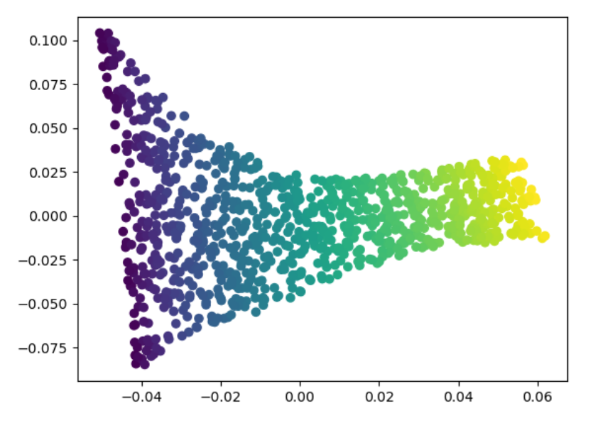
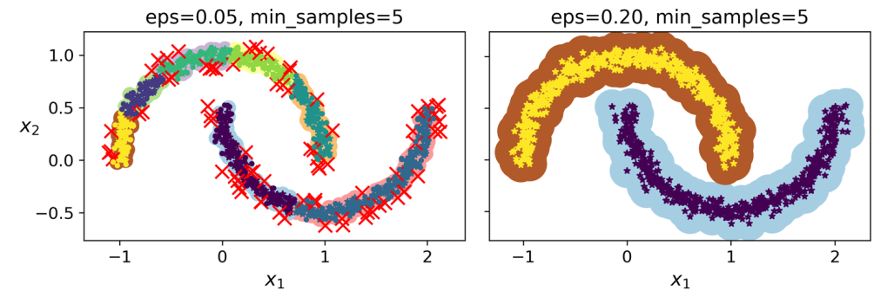
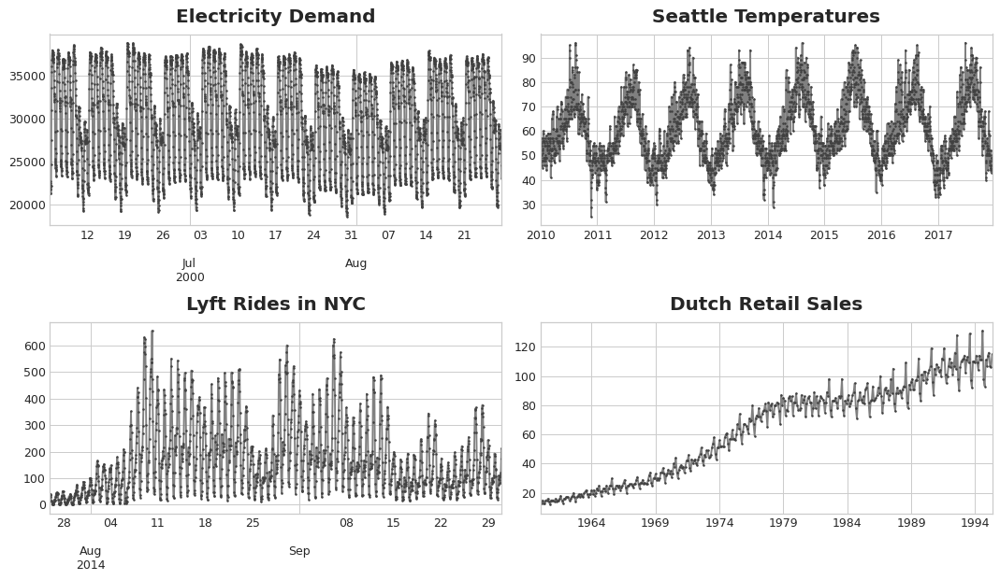

# Rodzaje uczenia maszynowego

Podziały ze względu na:

* nadzór:
  * **uczenie nadzorowane** - trzeba etykietować zbiór uczący
  * **uczenie nienadzorowane** - nie trzeba etykietować zbioru uczącego (uczenie bez nauczyciela)
  * **częściowo nadzorowane** - część danych jest etykietowana, część nie
  * **uczenie przez wzmacnianie** - polega na dawaniu kar i nagród za konkretne wybory, które algorytm uwzględnia przy kolejnych próbach 
* sposób uogólnienia:
  * **instancje (nieparametryczny) (np. KNN, drzewa)** - uczenie na pamięć, szuka najbardziej podobnego do pytanego obiektu i podpisuje go tak samo według poznanych zasad, przykład: K-nearest neighbors; przede wszystkim wielkość modelu jest nieznana przed rozpoczęciem uczenia
  * **model (parametryczny) (np. sieci neuronowe, regresja logistyczna, SVM)** - szuka zależności między wartościami i na ich podstawie dobiera parametry funkcji, na podstawie której potem przewiduje wartość; wielkość modelu jest znana przed rozpoczęciem uczenia
* dostęp do danych:
  * **batch** - posiadamy dostęp do kompletnego zbioru danych, jeśli możemy trzymać cały zbiór danych i dane nie zmieniają się zbyt często
  * **online (mini-batches)** - karmimy model ciągle małymi porcjami danych, jeśli nie mamy miejsca na utrzymanie całego zbioru lub dane ciągle się zmieniają
* prostota (interpretowalność) 
  * **White Box** - Prosty do zinterpretowania- wiemy dlaczego podjął taką a nie inną decyzję.
  * **Black Box** - Trudny do zinterpretowania- nie wiemy dlaczego podjął taką a nie inną decyzję.


# Metryki

## ***Klasyfikacja***

* Confusion Matrix 


{ width=60% }

    
    
### Accuracy

$$ Accuracy = \frac{TP + TN}{TP + TN + FP + FN} $$

* Classification Error
  * Wyraża jaka część instancji została dobrze sklasyfikowana

### Precision

$$ Precission = \frac{TP}{TP + FP} $$


* Stosowana gdy wymagamy od modelu wysoką wartość *True Positives* i chcemy zminimalizować liczbę *False Positives*
* Proporcja *True Positives* do *sumy True Positives i False Positives* 
* W przypadku diagnozowania poważnych chorób, takich jak rak. W tym przypadku chcemy minimalizować błędne diagnozy, aby uniknąć niepotrzebnych badań i leczenia dla osób, które nie potrzebują takiej interwencji.
* Np. Jak wiele wiadomości zaklasyfikowanych jako spam faktycznie jest spamem? 

### Recall (True Positive Rate, Sensitivity, Probability of Detection)

$$ Recall = \frac{TP}{TP + FN} $$

* Stosowana gdy wymagamy od modelu wysoką wartość *True Positives* i chcemy zminimalizować liczbę *False Negatives*
* Proporcja *True Positives* do *sumy True Positives i False Negatives*
* W przypadku wykrywania rzadkich chorób. Tutaj celem jest maksymalizacja liczby poprawnych diagnoz, aby zapewnić pacjentom odpowiednie leczenie w czasie.
* Np. Jak wiele wiadomości spamu zostało zaklasyfikowanych jako spam?

### F1-score

$$ \textit{F1-score} = \frac{2}{\frac{1}{Precision} + \frac{1}{Recall}} $$

* Metryka stosowana do porównywania modeli.
* Korzystne dla modeli z podobną wartością *Precision* i *Recall*.
* Średnia harmoniczna obu wartości.

### Kompromis Precision/Recall 

* *Precision* zmniejsza *Recall* i vice versa.
  
## ***Regresja***

Mean square error (błąd średnio kwadratowy):

$$ MSE(x, y) = \frac{1}{n} \sum_{i=1}^{n}{(f(x_{i}) - y_{i})^2} $$

* Błąd średnio-kwadratowy, najczęściej stosowany w przypadku regresji liniowej
* Stosowana ogólnie w regresjach
* Gdy funkcja f jest różniczkowalna, to MSE jest różniczkowalny ze względu na parametry funkcji f
* Równoważna z normą $l_2$ (Norma Euklidesowa)

Mean absolute error (błąd średnio bezwzględny):

$$ MAE(x, y) = \frac{1}{n} \sum_{i=1}^{n}{|f(x_{i}) - y_{i}|} $$

* Błąd średniego odchylenia wartości bezwzględnej
* Stosowana ogólnie w regres
* Stosowane gdy jest dużo *outlier'ów* w zbiorze
* Równoważna z normą $l_1$ (Norma Manhattan) 

Entropia:

$$ H(X) = -\sum_{i=1}^{n}{p(x_{i}) \log{p(x_{i})}} $$

* $p$ - proporcja wystąpień wartości docelowych w danych regresyjnych
* Wyraża ilość informacji, którą możemy uzyskać po otrzymaniu instancji ze zbioru
* Tworzy zbilansowane drzewa
* Tak dzielimy zbiór tworząc drzewa, aby zysk entropii był jak największy (dowiadujemy się najwięcej dzieląc w ten sposób)

Gini:

$$ Gini(X) = 1 -\sum_{i=1}^{n}{p(x_{i})^2} $$

* Wyraża czystość zbioru
* Szybsza do obliczenia (względem entropii, nie trzeba liczyć logarytmu)
* Ma tendencję do izolowania najczęściej występującej klasy w osobnej gałęzi drzewa. 
* Jest zerowa gdy wszystkie instancje w zbiorze są tej samej klasy
* Jest maksymalna gdy instancje są równomiernie rozłożone po klasach
* Wykorzystywana w algorytmie *CART* (Classification and Regression Tree).

Entropia krzyżowa:

$$ H(p, q) = -\sum_{i=1}^{n}{p(x_{i}) \log{q(x_{i})}} $$

* Stosowana w klasyfikacji
* Wyraża oczekiwaną ilość informacji o instancji, jeżeli zakodujemy ją przy użyciu modelu $q$ zamiast $p$
* $p(x_{i})$ - prawdziwy rozkład prawdopodobieństwa
* $q(x_{i})$ - rozkład prawdopodobieństwa przewidywany przez model
* Podczas uczenia modelu $q$ staramy się minimalizować entropię krzyżową, ponieważ to oznacza, że potrzebujemy mniejszej liczby bitów, żeby przewidzieć klasę instancji z rozkładu $p$ (dla rozkładu $p$ podczas uczenia zazwyczaj dokładnie znamy klasy każdej z instancji, więc entropia rozkładu $p$ jest równa 0).

# Regresja

## Regresja

### Regresja Liniowa

* Opiera się na założeniu, że istnieje liniowa zależność między zmiennymi wejściowymi a zmienną wyjściową.
* Dopasowuje hiperpłaszczyznę (określoną funkcją $g$), dla której średnia odległość instancji od wartości funkcji $g$ jest najmniejsza.
* Mamy zbiór wektorów $A \subseteq \mathbb{R^{n + 1}}$ i funkcję $f: A \rightarrow \mathbb{R}$, która przyporządkowuje każdemu wektorowi $x \in A$ wartość $f(x)$
* Każdy wektor ze zbioru $A$ ma postać $x = [x_0, x_1, ..., x_n]$, gdzie $x_0 = 1$
* Chcemy znaleźć funkcję $g: \mathbb{R}^{n + 1} \rightarrow \mathbb{R}$ taką, że $g(x)=\Theta^Tx$ dla pewnego wektora $\Theta \in \mathbb{R}^n$ i wektor $\Theta$ minimalizuje $MSE(x, \Theta) = \frac{1}{n} \sum_{i=1}^{n}{(\Theta^Tx - f(x))^2}$
* Można pokazać, że jeżeli mamy wektor $z$ wszystkich wartości $f(x)$ dla wszystkich wektorów ze zbioru $A$ oraz $X$ jest macierzą złożoną ze wszystkich wektorów z A, to $\Theta=(X^TX)^{-1}X^T$

### Regresja wielomianowa

* Regresja liniowa, ale zamiast liniowej funkcji $g$ używamy wielomianu $g$ stopnia $n$
* Do każdej instancji $x$ dodajemy nowe cechy $x_2 = x^2, x_3 = x^3, ..., x_n = x^n$, następnie stosujemy regresję liniową na nowym zbiorze cech.

### Regresja Logistyczna
* Wykorzystuj funkcję aktywacji $f(x) = \frac{1}{1+e^{-x}}$ (Sigmoid)
* Szacuje prawdopodobieństwo przynależności instancji do pewnej klasy.
* Stosuje funkcji *sigmoid* do zwrócenia prawdopodobieństwa (Sigmoid zwraca wartości między 0 a 1).

## Gradient Descent

* Stosowany jeżeli nie można znaleźć rozwiązania analitycznego (np. w przypadku regresji logistycznej), a rozważana funkcja jest ciągła i różniczkowalna w rozważanej dziedzinie
* Zaczynamy ze startowym wektorem x z dziedziny analizowanej funkcji
* Obliczamy gradient funkcji w punkcie x
* Przesuwamy się w kierunku przeciwnym do wektora gradientu, ponieważ gwarantuje to najszybsze możliwe zmniejszanie się wartości funkcji
* Znajduje minimum lokalne.

### SGD Stochastic Gradient Descent:

* Stosowany w przypadku, gdy zbiór danych jest bardzo duży
* Do obliczania gradientu wybieramy losowo podzbiór danych
* Znajduje minimum lokalne, szybciej niż *Gradient Descent*, ale nie jest tak dokładny.
  
## Learning Curves

### Bias

* Błąd generalizacji wynikający ze złych założeń. Prowadzi do *underfittingu*
* Model jest najprawodopodobniej zbyt prosty.

### Variance

* Nadmierna wrażliwość na małą wariancję w zbiorze danych. Prowadzi do *overfittingu*
* Model jest najprawodopodobniej zbyt skomplikowany.

### Irreducible Error

* Wynika z zaszumionego zbioru danych.
  
### Kompromis między *Bias* a *Variance*

* Zwiększenie złożoności modelu prowadzi do zwiększenia *Variance* i zmniejszenia *Bias'u* i vice versa.

---

## Regularyzowane modele liniowe

### Ridge Regression

* Regularyzowana wersja *Regresji Liniowej*
* Zmusza model do utrzymywania małych wag
* Używa normy $l_2$

### Lasso Regression

* Regularyzowana wersja *Regresji Liniowej*
* Używa normy $l_1$
* Ma tendencje do usuwania wag dla najmniej ważnych cech
* Zwraca *Rzadki model* (Dużo zer w polach wag)

### Early Stopping

* Zatrzymuje proces uczenia w momencie gdy *błąd walidacji* osiąga minimum.

---


# SVM (Support Vector Machines)

* Algorytm klasyfikacji oparty o zasadę największego marginesu. 
  
  

* Wrażliwy na skalowanie danych (Zawsze skalować przed użyciem)
* 
## Hard Margin Classification

* Wszystkie instancje muszą się znaleźć poza marginesem.
* Działa tylko wtedy, gdy dane da się liniowo rozdzielić.
* Wrażliwy na *outliers'y*

## Soft Margin Classification

* Elastyczny model
* Szyka balansu między posiadaniem jak największego marginesu, a limitowaniem liczby jego naruszeń.

## Nieliniowa klasyfikacja SVM

* Używaj kiedy dane nie da się rozdzielić liniowo.

### Polynomial Kernel

* Sztuczka dzięki której możemy dostać wyniki, jakbyśmy korzystali z wielomianowego modelu bez użycia go.

## Regresor SVM

* By działał musimy odwrócić jego zadanie - zmieścić jak najwięcej instancji w jak najmniejszym marginesie.
  


* Model jest $\epsilon$ niewrażliwy, czyli dodawanie więcej instancji znajdujących się w marginesie nie wpływa na zdolność przewidywania modelu.
* Do rozwiązywania nieliniowych modeli użyj **kernelized SVM model**


## Drzewa Decyzyjne

* Stosowany do klasyfikacji i regresji
* Nie wymaga przygotowania danych, nie trzeba skalować ani centrować
* Scikit używa algorytmu **CART** (próbuje zachłannie minimalizować współczynnik Gini) do trenowania drzew decyzyjnych
* Algorytm **CART** w celu ustalenia miejsca podziału oblicza wartość \
$J(k, t_k) = \frac{m_{lewa}}{m} * G_{lewa} + \frac{m_{prawa}}{m} * G_{prawa}$, gdzie $G_{lewa}$ i $G_{prawa}$ wyrażają nieczystości lewej i prawej części po podziale, a $m_{lewa}$ i $m_{prawa}$ to liczba instancji w lewej i prawej części, $m$ to liczba wszystkich instancji
* Obrót przestrzeni instancji może całkowicie zmieniać wygenerowane drzewo i jego złożoność.

### White Box vs Black Box

* W przypadku *Black Box* ciężko jest sprawdzić dlaczego dany model podjął taką decyzję
* Dla modeli, które nie są *White Box* bardzo trudnym zadaniem jest dokładne określenie wnioskowania przeprowadzonego przez model, które może być łatwo zrozumiane przez człowieka0
* Przykłady *White Box*:
  * Drzewa decyzyjne
  * Regresja Liniowa
  * SVM
* Przykłady *Black Box*:
  * Sieci neuronowe
  * Random Forests

### Hiperparametry

* Bez żadnych ograniczeń model bardzo szybko przeucza się (Wtedy go nazywamy nieparametrycznym, opisany wyżej)
* ***Regularyzacja*** jest procesem mającym przeciwdziałać przeuczeniu, przez dobranie odpowiednich hiperparametrów
  * Najważniejszą wartość jaką możemy dostrajać jest ograniczenie maksymalnej *głębokości drzewa* (Domyślnie jest $\infty$)

### Regresja

* Struktura drzewa przypomina tą z problemu klasyfikacji.
* Możemy uznać problem regresji jako problem klasyfikacji z nieograniczoną liczbą klas, którą możemy regulować przez maksymalną głębokość drzewa.


# Ensemble Learning i Random Forests

* Wykorzystywana jest moc przyjaźni (ang. *Power of friendship*).
* Stosujemy zasadę *mądrości tłumu* - jeżeli mamy wiele klasyfikatorów, to możemy je zagregować w grupę klasyfikatorów znacznie zwiększając wydajność modelu.
* Wszystkie klasyfikatory powinny być od siebie niezależne
* Redukuje *Bias* i *Variance*

## W problemie klasyfikacji rozróżniamy 2 rodzaje klasyfikatorów:


### *Hard Voting Classifier*

* Wybiera klasę, która jest dominantą zbioru propozycji klas zwróconych przez klasyfikatory.

### *Soft Voting Classifier*

* Wykorzystuje prawdopodobieństwa zwracane przez model, następnie uśrednia je i wybiera klasę z najwyższym średnim prawdopodobieństwem.

## Bagging i Pasting

* Wykorzystują wiele instancji klasyfikatora tego samego typu, ale trenowanych na różnych podzbiorach danych.

* **Bagging** (Bootstrap Aggregating) polega na losowaniu instancji ze zwracaniem (zastępowaniem) i trenowaniu na nich różnych klasyfikatorów, a następnie wykorzystaniu metody *hard voting* do wyboru klasy.
* **Pasting** jest podobny do *Bagging'u*, ale zamiast losować instancje ze zwracaniem, losuje je bez zwracania, co oznacza, że każdy klasyfikator może być trenowany tylko na części danych, a liczba klasyfikatorów jest ograniczona przez liczbę instancji w zbiorze treningowym.

## Random Forests

* Zbiór drzew decyzyjnych
* Dodaje extra losowość
* Umożliwia łatwe sprawdzenie istotności pewnej cechy
* Jeżeli zastosujemy *Bagging* na drzewach decyzyjnych, to otrzymamy *Random Forest*
* Agreguje predykcje ze wszystkich drzew i wybiera klasę o największej ilości głosów (hardvoting)
  * Grupa drzew decyzyjnych
  * Każdy uczy się na innym podzbiorze zbioru danych

### Extremely Randomized Trees Ensembly

* Szybciej się uczy
* Stosuje losowe progi dla każdej cechy
  
## Boosting

* Łączy wiele *weak learners* w *strong learner*
* Trenuje predyktory sekwencyjnie
  * Każdy kolejny próbuje poprawić błędy poprzedniego

### AdaBoost

* Adaptive Boosting
* Zwraca uwagę na instancje słabo dopasowane przez poprzednie predyktory.
* Nie skaluje się dobrze.

### Gradient Boosting

* Możemy go użyć z różnymi funkcjami straty
* Dopasowuje nowy predyktor do pozostałego błędu przez poprzedni model
* **XGBoost**
  * Aktualnie najlepszy klasyfikator (razem z CatBoostem).


## Stacking

* Metoda podobna do *Voting Classifier'a*, ale zamiast używać prostych funkcji do agregacji predykcji, trenuje model, aby nauczył się jak łączyć predykcje innych modeli
* Możliwe jest stosowanie bardziej zagnieżdżonych architektur, w których występują kolejne warstwy modeli.

# Redukcja Wymiarów


* Stosujemy do uproszczenia zbioru danych w celu przyspieszenia procesu uczenia modelu
* Prowadzi do utraty części informacji, umożliwiając jednocześnie lepszą wydajność modelu
* Może być również wykorzystywana do wizualizacji danych.

## Curse of Dimensionality

* Odnosi się do zjawiska, w którym dodanie kolejnych wymiarów do zbioru danych powoduje znaczny (eksponencjalny) wzrost wymaganej ilości danych do zachowania odpowiedniej gęstości danych.

## PCA - Principal Component Analysis


* Jest to metoda redukcji wymiarów, w której wybieramy kierunki, które zachowują najwięcej informacji
* Kierunki te są nazywane **principal components**
* PCA znajduje kierunki, które minimalizują *średnią kwadratową odległość* między punktami danych a ich rzutami na kierunki
* Staramy się znaleźć takie kierunki, dla których występuje największa wariancja danych
* Na początku standaryzujemy dane, aby średnie wartości były równe 0
* Znajdujemy bazę przestrzeni, która jest najbardziej zbliżona do danych pod względem *średniej kwadratowej odległości* dla punktów danych i ich rzutów na bazę
* Istnieje szybszy algorytm randomizowany, który znajduje przybliżone rozwiązanie.

### SVD - Singular Value Decomposition

* Jest to metoda rozkładu macierzy na iloczyn 3 macierzy
* Umożliwia wyznaczenie kierunków, które zachowują najwięcej informacji
* Stosowana w PCA
* Uogólnienie wartości własnych i wektorów własnych na macierze niekwadratowe
* Największe wartości singularne odpowiadają kierunkom, które zachowują najwięcej informacji.

## Incremental PCA 
* minibatch, out-of-core, praca na strumieniach, trzeba podać liczbę wymiarów
* Czyli w sumie po prostu PCA na online(minibatches), gdzie nie ładujemy całego zestawu danych na raz do modelu

## Rozmaitości


* Są to zbiory danych, które mogą być zredukowane do mniejszej liczby wymiarów, ale nie muszą być przestrzeniami liniowymi
* W małej skali wyglądają jak przestrzenie liniowe, ale w większej skali mogą mieć kształty przeróżne
* Zastosowanie dla nich algorytmu PCA może prowadzić do zbyt intensywnej utraty informacji
* Istnieją algorytmy, które pozwalają na redukcję wymiarów dla takich zbiorów danych.

### LLE - Locally Linear Embedding



* Algorytm ten znajduje lokalne zależności między punktami danych, a następnie próbuje zachować te zależności w niższej wymiarowości
* Jest to algorytm nienadzorowany
* Może prowadzić do zniekształcenia danych w dużej skali
* W pierwszym kroku znajduje najbliższych sąsiadów dla każdego punktu danych
* Następnie znajduje wagi, które pozwalają na rekonstrukcję każdego punktu danych jako kombinacji liniowej jego najbliższych sąsiadów
* W ostatnim kroku rzutuje dane na przestrzeń o niższej wymiarowości, zachowując lokalne zależności.

# Uczenie nienadzorowane

Kategorie uczenia nienadzorowanego:

* Klasteryzacja *clustering*
  * identyfikacja klas
  * redukcja wymiarów
  * analiza danych (po klasteryzacji, dla każdej klasy osobno)
  * uczenie częściowo nadzorowane
  * segemntacja obrazu, detekcja, kompresja
* Detekcja anomalii
  * detekcja wartości odstających, *outlierów*
* Estymacja gęstości *density estimation*


## Soft Clustering
* Przypisuje każdej instancji wynik przypisywany dla każdego klastra.
  * Wynikiem może być np. dystans pomiędzy instancją a centroidą.

## Hard Clustering
* Każda instancja jest przypisana do 1 klastra.

## DBSCAN

* Algorytm DBSCAN (*Density-Based Spatial Clustering of Applications with Noise*) jest algorytmem klasteryzacji, który znajduje skupiska o wysokiej gęstości
* Algorytm ten znajduje skupiska o wysokiej gęstości, a także punkty odstające
* Algorytm ten nie wymaga określenia liczby klastrów
* Wymaga określenia dwóch parametrów: *eps* i *min_samples*
  * *eps* - maksymalna odległość między dwoma punktami, aby zostały one uznane za sąsiadów
  * *min_samples* - minimalna liczba punktów, aby uznać je za rdzeń (wliczając w to punkt, dla którego szukamy sąsiadów)
* Wszystkie instancje, które nie są rdzeniami, ale mają sąsiadów, są uznawane za brzegi, wchodzą w skład tego samego klastra, co ich rdzeń
* Instancje, które nie są ani rdzeniami, ani brzegami, są uznawane za anomalią (nie należą do żadnego klastra)



## KNN - K-nearest neighbors

* Algorytm KNN (*K-nearest neighbors*) jest algorytmem klasyfikacji, który przypisuje nową instancję do klasy, która jest najbardziej popularna wśród *k* najbliższych sąsiadów
* W przypadku regresji algorytm ten zwraca średnią wartość *k* najbliższych sąsiadów
* Jeżeli *k* jest zbyt małe, to algorytm ten jest podatny na szumy
* W przypadku remisu:
  * **wybór pierwszej napotkanej instancji** (implementacja scikit-learn)
  * wybór losowy
  * wybór liczniejszej klasy 
  * wybór wartości najbliższej instancji (tylko dla regresji)
  * brana pod uwagę jest odległość od instancji do sąsiada (średnia ważona) (tylko dla regresji)
  * średnia wartość wszystkich instancji o tej samej odległości (tylko dla regresji)


## Algorytm centroidów (k-średnich) *K-Means*

* Algorytm centroidów (k-średnich) *K-Means* jest jednym z najpopularniejszych algorytmów klasteryzacji.
* Algorytm stara się znaleźć środek każdego z *k* skupisk
* Algorytm ten przypisuje każdy punkt danych do najbliższego centroidu, a następnie przesuwa centroidy tak, aby minimalizować średnią kwadratową odległość między punktami danych a ich centroidami
* *k* jest parametrem algorytmu, który musi zostać określony przez użytkownika
* Jest zbieżny
* Nie gwarantuje znalezienia optimum (zależy od kroku 1)
  * Domyślnie algorytm uruchamiany jest 10 razy
  * Wybierany jest model z najmniejszą **inercją**: średnio-kwadratowa odległość między instancjami i ich centroidami
    * zmierz odległość między instancjami a ich centroidami
    * zsumuj kwadraty w/w odległości w ramach klastra
    * zsumuj wartości inercji dla wszystkich klastrów
* Przedstawieniem wyniku działania algorytmu jest Diagram Woronoja *Voronoi*
* *K-Means++*
  * Nowsza wersja
  * W bardziej optymalny sposób dobiera początkowe centroidy
* *Mini batch K-Means*
  * Używa *batch* zamiast całego zbioru danych
* W przypadku równej odległości do więcej niż jednego centroida instancja jest przypisywana do **losowego centroidu**, pierwszego napotkanego centroidu lub wybierany jest centroid grupujący większą liczbę instancji 


### Wyznaczanie liczby klastrów

Do wyznaczenia liczby klastrów nie wystarcza sama inercja, ponieważ maleje ona wraz ze zwiększaniem się liczby klastrów.


**Inercja** nie wystarcza, ale można ją wykorzystać. Wystarczy wyznaczyć inercję dla różnych wartości *k* i wybrać tę, która jest na 'zgięciu' wykresu.\


Do wyznaczenia liczby klastrów możemy również wykorzystać **Wskaźnik sylwetkowy, *silhouette score***. Wskaźnik bierze pod uwagę średnią odległość pomiędzy obserwacjami wewnątrz grupy ($a_i$) i średnią odległość pomiędzy obserwacjami do najbliższej "obcej" grupy ($b_i$) i dany jest wzorem:

$$ s = \frac{1}{k} \sum^k_{i=1} \frac{b_i-a_i}{max(a_i,b_i)} $$

* Najlepsza wartość: 1
* Najgorsza wartość: -1
* Nakładające się wartości: w pobliżu 0


# Sieci neuronowe - wprowadzenie

## Perceptron

* Składają się z jednej warstwy neuronów
* Każdy neuron jest jednostką liniową, po której następuje funkcja aktywacji
* Sposób działania:
  * oblicz sumę wejść $z = w_1x_1 + w_2x_2 + ... + w_nx_n = x^Tw$
  * zastosuj funkcję schodkową: $h_w(x) = step(z)$
* Ograniczenia:
  * Nie potrafią rozwiązać pewnych trywialnych problemów, np. XOR. W takich przypadkach stosuje się **sieci wielowarstwowe (MLP)**


### Uczenie perceptronu

* Uczenie perceptronu polega na znalezieniu wektora wag $w$, który pozwoli na poprawne sklasyfikowanie jak największej liczby instancji
* Wagi są aktualizowane na podstawie błędu predykcji według wzoru $w_{i,j}^{(następna iteracja)} = w_{i,j} + \eta(y_j - \hat{y_j})x_i$
  * $w_{i,j}$ - waga połączenia między neuronem $i$ a neuronem $j$
  * $\eta$ - współczynnik uczenia
  * $y_j$ - wartość oczekiwana
  * $\hat{y_j}$ - wartość przewidziana
  * $x_i$ - wartość wejścia


## Funkcje aktywacji

### Dlaczego potrzebujemy funkcji aktywacji?
* Konieczność nieliniowości
  * Jeżeli używamy liniowych funkcji aktywacji, to kilka nałożonych na siebie warstw jest równoważna z jedną warstwą.
  * Sieć neuronowa będzie zachowywać się jak jedna warstwa neuronów (dla macierzy $W_1$ i $W_2$ będzie można znaleźć macierz $W$, która będzie równoważna działaniu sieci neuronowej, $W = W_2W_1$)
* Potrzebujemy dobrze zdefiniowanej niezerowej pochodnej
  * *Gradient Descent* robi progres w każdym kroku. 

Poniższa lista jest ułożona od najlepszych funkcji aktywacji (oprócz ``softmax``).

1. SeLU (Skalowana liniowa jednostka eksponencjalna)
  * Najlepsze dla *Głębokiej Sieci Neuronowej* 
  * Potrafi się samodzielnie znormalizować
    * Rozwiązuje problem znikających i eksplodujących gradientów.
  * Warunki zbioru danych:
    * Wszystkie warstwy muszą być gęste
    * Dane muszą być standaryzowane (średnia = 0, odchylenie standardowe = 1).
    $$ SeLU(z) = \begin{cases} \lambda \alpha (e^z - 1) & \text{if } z < 0 \\ \lambda z & \text{if } z \geq 0 \end{cases} $$

2. ELU (Exponential Linear Unit):
  * ELU jest podobne do SeLU, ale nie jest zależne od normalizacji danych.
  * Funkcja ELU ma mniejszą podatność na problem znikających i wybuchających gradientów.
    $$ ELU(z) = \begin{cases} \alpha (e^z - 1) & \text{if } z < 0 \\ z & \text{if } z \geq 0 \end{cases} $$

3. Leaky ReLU
  * Leaky ReLU jest modyfikacją funkcji ReLU, która rozwiązuje problem "martwych neuronów" (neurony, które zawsze mają wartość 0 dla niektórych danych wejściowych).
    $$ LeakyReLU(z) = max(\alpha z, z) $$   

4. ReLU (Rectified Linear Unit):
  * ReLU jest jedną z najpopularniejszych funkcji aktywacji. Ma dobrą zdolność do modelowania nieliniowych relacji.
  * Jeżeli wszystkie wartości danych treningowych są ujemne, to neuron z ReLU się nie uczy
    $$ ReLU(z) = max(0, z) $$

5. Tanh (tangens hiperboliczny):
  * Funkcja tanh jest splotem funkcji sigmoidalnej i może generować wartości z przedziału (-1, 1).
  * Funkcja ta ma symetryczny kształt wokół zera i może być przydatna w przypadkach, gdy oczekuje się zarówno wartości dodatnich, jak i ujemnych.
    $$ tanh(z) = 2\sigma(2z) - 1 $$
  
6. logistic (funkcja sigmoidalna):
  * Funkcja sigmoid, znana również jako funkcja logistyczna, generuje wartości z przedziału (0, 1).
  * Często jest używana w warstwie wyjściowej modeli binarnych do przewidywania prawdopodobieństwa przynależności do jednej z dwóch klas.
    $$ \sigma(z) = \frac{1}{1+e^{-z}} $$

7. Softmax
  * Funkcja aktywacji wykorzystywana w warstwie wyjściowej klasyfikatorów wieloklasowych, generuje rozkład prawdopodobieństwa.
  * Opisuje pewność dopasowania do każdej klasy.
  
    $$ Softmax(z)_j = \frac{e^{z_j}}{\sum_{k=1}^K e^{z_k}} $$
  


## Warstwy

### Warstwa gęsta

* Każdy neuron jest połączony z każdym neuronem z poprzedniej warstwy
* Wagi połączeń są zapisane w macierzy wag $W$*
* Każdy neuron ma dodatkowy parametr $b$, który jest nazywany *biasem* - w innym przypadku dla wektora zerowego na wejściu, na wyjściu otrzymalibyśmy wektor zerowy (jeżeli funkcja aktywacji ma punkt stały w 0)

# Głębokie sieci neuronowe

Głębokie sieci neuronowe (DNN - Deep Neural Networks) to sieci neuronowe z wieloma warstwami ukrytymi

## Budowa modelu

### Keras Sequential API

* Najprostszy sposób tworzenia sieci neuronowej
* Zakłada, że sieć jest sekwencją warstw
* Warstwy dodajemy jako instancje odpowiednich klas z pakietu keras.layers
* parametr można przekazywać jako ciągi znaków. Jest to zapis uproszczony: zamiast ```"relu"``` można przekazać ```keras.activations.relu```
* Normalizację danych można wykonać za pomocą warstwy ```keras.layers.Normalization```, lub ```keras.layers.Flatten```, albo zrobić samemu wcześniej

```python
import tensorflow as tf

model = tf.keras.Sequential([
    tf.keras.layers.Flatten(input_shape=[28, 28]),
    tf.keras.layers.Dense(300, activation="relu"),
    tf.keras.layers.Dense(100, activation="relu"),
    tf.keras.layers.Dense(10, activation="softmax")
])
```

### Keras Functional API

* Pozwala na tworzenie bardziej skomplikowanych architektur sieci neuronowych
* Pozwala na tworzenie grafów obliczeniowych, w których nie wszystkie warstwy są połączone ze sobą w sekwencji
* Pozwala na tworzenie wielu modeli, które mają współdzielone warstwy
* Do tworzenia modelu wykorzystujemy klasę ```tf.keras.Model```, podaje się w niej warstwy wejściowe i wyjściowe
* Do tworzenia warstw wykorzystujemy klasę ```tf.keras.layers```, podobnnie jak w przypadku ```Sequential``` API
* Łączenie warstw odbywa się za pomocą operatora ```(warstwa)(wejście)```, podobnie jak w przypadku wywoływania funkcji, co oznacza, że warstwa jest wywoływana na wejściu otrzymanym z poprzedniej warstwy będącej argumentem wywołania

```python
import tensorflow as tf

input_ = tf.keras.layers.Input(shape=[28, 28])
flatten = tf.keras.layers.Flatten(input_shape=[28, 28])(input_)
hidden1 = tf.keras.layers.Dense(300, activation="relu")(flatten)
hidden2 = tf.keras.layers.Dense(100, activation="relu")(hidden1)
concat = tf.keras.layers.Concatenate()([input_, hidden2])
output = tf.keras.layers.Dense(10, activation="softmax")(concat)
model = tf.keras.Model(inputs=[input_], outputs=[output])
```

## Kompilacja i uczenie modelu

Po utworzeniu modelu należy go skompilować za pomocą metody ```compile()```. Metoda ta przyjmuje następujące parametry: 

* ```optimizer```: Określa **optymalizator** używany do aktualizacji wag modelu podczas procesu uczenia.Optymalizator reguluje sposób, w jaki model aktualizuje wagi na podstawie straty i algorytmu optymalizacji. Ich argumentem jest m.in. ```learning_rate```. Przykładowe optymalizatory:

  * ***SGD*** - Stochastic Gradient Descent
  * ***Momentum*** - SGD z pędem
  * ***Nesterov Accelerated Gradient*** - SGD z pędem Nesterova
    * Szybka zbieżność
    * Minimalnie szybsza od *Momentum*
  * ***AdaGrad*** - Adaptive Gradient, nie wykorzystuje pędu, ale dostosowuje współczynnik uczenia dla każdego parametru na podstawie jego historii aktualizacji
    * Działa dobrze dla prostych problemów kwadratowych
    * Ryzyko nie osiągnięcia minimum
  * ***Adam*** - Adaptive Moment Estimation, wykorzystuje pęd i historię aktualizacji
    * Wariancje  *Adam*:
      * **Nadam** (Adam + Nesterov) - Generalnie jest lepsza od *Adam*
  * ***RMSProp*** - Zbiera gradienty tylko z najwcześniejszych iteracji
    * Wiele lepszy niż *AdGrad*
    * **Problemy *Adaptive estimation methods***
      * M. in. Adam, Nadam, RMSProp, Adagrad
      * Mogą źle generalizować zbiory danych
      * Jak są jakieś problemy użyj *Nesterov Accelerated Gradient* 

* ```loss```: Określa **funkcję straty**, która jest używana do oceny odchylenia między przewidywaniami modelu a rzeczywistymi wartościami. Przykładowe funkcje straty to 'mean_squared_error', 'categorical_crossentropy', 'binary_crossentropy' itp. Wybór odpowiedniej funkcji straty zależy od rodzaju problemu i rodzaju wyjścia modelu.

* ```metrics```: Określa **metryki**, które będą używane do oceny wydajności modelu. Przykładowe metryki to 'accuracy', 'precision', 'recall', 'mean_absolute_error' itp. Metryki służą do monitorowania wydajności modelu podczas uczenia i ewaluacji.

* Inne opcjonalne argumenty, takie jak loss_weights, sample_weight_mode, weighted_metrics, które pozwalają na bardziej zaawansowane konfigurowanie procesu kompilacji modelu.

```python
model.compile(loss="adam",
              optimizer="sgd",
              metrics=["accuracy"])
```

A następnie wytrenować model za pomocą metody ```fit()```. Metoda ta przyjmuje następujące parametry:

* ```x```: **Dane wejściowe** do modelu.

* ```y```: **Dane wyjściowe** (etykiety) odpowiadające danym wejściowym x.

* ```batch_size```: Określa liczbę próbek, które są przetwarzane jednocześnie przez model w trakcie jednej iteracji.

* ```epochs```: Określa liczbę **epok uczenia** - pełnych przebiegów przez zbiór treningowy. Każda epoka oznacza jedno przejście przez cały zbiór treningowy.

* ```validation_data```: **Dane walidacyjne** używane do oceny wydajności modelu na każdej epoce. Może to być krotka (x_val, y_val) zawierająca dane wejściowe i oczekiwane wyjście dla danych walidacyjnych.

* ```callbacks```: Lista obiektów zwrotnych (callbacks), które są wywoływane podczas treningu w różnych momentach. Przykłady to ModelCheckpoint, EarlyStopping, TensorBoard itp. Callbacks pozwalają na dostosowywanie zachowania treningu w zależności od określonych warunków.
* ```verbose```: Określa tryb wyświetlania informacji podczas treningu. Może przyjąć wartość 0 (bez wyświetlania), 1 (wyświetlanie paska postępu) lub 2 (wyświetlanie jednej linii na epokę).

* Inne opcjonalne argumenty, takie jak validation_split, shuffle, class_weight itp., które pozwalają na bardziej zaawansowane konfigurowanie procesu treningu modelu.

```python
history = model.fit(
    X_train, 
    y_train, 
    batch_size=32, 
    epochs=10, 
    validation_data=(X_valid, y_valid),
    callbacks=[early_stopping_cb],
    verbose=1
)
```

## Callbacks

Callbacki pozwalają na wykonywanie dodatkowych operacji w trakcie uczenia modelu. Użyteczne jak mamy długi czas uczenia. Przykładowe callbacki ich ich zastosowania:

* ```ModelCheckpoint``` - Zapisywanie punktów kontrolnych

* ```EarlyStopping``` - zatrzymanie uczenia, jeżeli nie nastąpi poprawa wyniku przez 10 epok (bardzo częste zastosowanie)
  
* ```TensorBoard``` - zapisywanie logów do wykorzystania w TensorBoard

```python
checkpoint_cb = keras.callbacks.ModelCheckpoint(
    "my_keras_model.h5",
    save_best_only=True
)
 
early_stopping_cb = keras.callbacks.EarlyStopping(
    patience=10,
    restore_best_weights=True
)

tensorboard_cb = keras.callbacks.TensorBoard(
    log_dir="./my_logs",
    histogram_freq=1,
    profile_batch=100
)
```

Callbacki dodajemy w parametrze ```callbacks``` metody ```fit```.

## Analiza procesu uczenia


* ***Loss*** - miara, która określa, jak bardzo wyniki modelu różnią się od oczekiwanych wartości.

* ***Accuracy*** - miara, która określa, jak dokładnie model przewiduje klasy lub etykiety dla danych.

* ***Recall*** - miara, która określa, jak wiele pozytywnych przypadków zostało wykrytych przez model.

* ***Precision*** - miara, która określa, jak wiele pozytywnych przypadków zostało poprawnie określonych przez model.

* ***Val_loss*** - strata obliczana na danych walidacyjnych, służy do monitorowania uczenia modelu i unikania przeuczenia.

* ***Val_accuracy*** - dokładność obliczana na danych walidacyjnych, pomaga ocenić, jak dobrze model generalizuje na nowych danych.

Przykłady funkcji strat zostały przedstawione na początku dokumentu.

{ width=3cm } 

## Przeszukiwanie przestrzeni hiperparametrów

### SciKit-Learn

* ```RandomizedSearchCV``` - losowe przeszukiwanie przestrzeni hiperparametrów
  * Lepsze od GridSearch
* ```GridSearchCV``` - przeszukiwanie przestrzeni hiperparametrów siatką wartości parametrów
  * Wydajny gdy funkcja jest szybka w obliczeniu. (Model mało skomplikowany)
* Jak mamy bardziej złożony model to polecam bibliotekę *Optuna*

### Keras Tuner

* ```RandomSearch``` - losowe przeszukiwanie przestrzeni hiperparametrów


# Konwolucyjne sieci neuronowe

* Konwolucyjne sieci neuronowe (CNN - Convolutional Neural Networks)
* CNN są stosowane do przetwarzania wielowymiarowych danych, takich jak obrazy, wideo itp.
* Wykorzystują specjalny rodzaj warstwy zwanej warstwą konwolucyjną (Convolutional Layer), która wykonuje operację konwolucji na danych wejściowych.
* Wymagają mniejszej liczby parametrów (względem *DNN*).
* Rozbijamy większy problem (np. rozpoznawanie obrazów) na mniejsze prostsze problemy (np. wykrywanie krawędzi).

## Konwolucja

* Struktura Hierarchiczna.
* Zamiast 1 wielkiej warstwy używamy wielu tych samych, małych liniowych warstw w każdej pozycji.
* koncentruje się na niskopoziomowych cechach w początkowych ukrytych warstwach, w kolejnej warstwie agreguje je do większej wysokopoziomowej cechy.
* Konwolucja to operacja matematyczna, która łączy dwa zestawy danych za pomocą funkcji matematycznej, aby wygenerować trzeci zestaw danych.
* W przypadku konwolucyjnych sieci neuronowych operacją konwolucji jest iloczyn skalarny (mnożenie element-wise) dwóch zestawów danych.
* Konwolucja jest operacją liniową, która może być używana do wielu celów, takich jak wykrywanie krawędzi i innych wzorców w obrazach, wykrywanie cech w danych itp.
* Polega na wykonywania sum ważonych dla fragmentów funkcji wejściowej ważonej przez jądro (kernel, który jest macierzą wag).
* W przypadku sieci neuronowych dane wejściowe są zwykle macierzą wielowymiarową (np. obrazem) i są one łączone z macierzą wag (kernel), aby wygenerować macierz wyjściową
* Wagi są parametrami, które są uczone podczas treningu modelu
* W przypadku obrazów macierz wejściowa zawiera piksele obrazu, a macierz wag zawiera filtry, które są aplikowane na obrazie
* Konwolucja może być obliczana na całym obrazie, ale zwykle stosuje się ją tylko do fragmentu obrazu, aby uzyskać macierz wyjściową o takich samych wymiarach jak macierz wejściowa
* W przypadku obrazów wagi są zwykle małymi macierzami o wymiarach 3x3 lub 5x5. W przypadku obrazów kolorowych, które mają 3 kanały kolorów (RGB), macierz wag ma wymiary 3x3x3 lub 5x5x3.
* Każda warstwa konwolucyjna składa się z wielu filtrów, które są stosowane do danych wejściowych, aby wygenerować różne macierze wyjściowe w celu wykrycia różnych cech w danych wejściowych


## Typowe błędy podczas projektowania CNN

* Stosowanie za dużych jądr konwolucji (Wyjątek: Pierwsza warstwa konwolucyjna)
  * Zamiast tego nałóż więcej mniejszych warstw
    * Prowadzi to do mniejszej liczby parametrów i mniejszej liczby obliczeń.

## Pooling

* Pooling neuron nie posiada wagi
  * Jej celem jest agregacja wejść korzystając z funkcji *max* lub *mean*.
* Pooling jest operacją, która zmniejsza wymiary danych wejściowych poprzez zastąpienie fragmentu danych wejściowych pojedynczą wartością reprezentującą ten fragment zwracaną przez sprecyzowaną wcześniej funkcję
* Najczęściej stosowaną funkcją agregującą jest funkcja max, która zwraca maksymalną wartość w fragmencie danych wejściowych
* Pozwala kolejnym warstwom sieci na wykrywanie cech bardziej ogólnych, poprzez zwielokrotnienie obszaru, na którym bezpośrednio działają
* Często stosowany po warstwie konwolucyjnej, aby zmniejszyć wymiary danych wejściowych
* Najczęściej zmniejsza każdy wymiar danych wejściowych o połowę.

## Dropout

* Sprawia, że wielka sieć działa jak mniejsza losowo trenując podsekcje sieci.
  * __*Mniejsze sieci neuronowe nie mają skłonności do przeuczenia*__
* Dropout jest techniką regularyzacji, która losowo wyłącza neurony podczas uczenia
* Pomaga w zapobieganiu przeuczeniu modelu.

## Uczenie rezydualne (Residual Learning)

* Residual Learning jest techniką uczenia głębokich sieci neuronowych, która skupia się na uczeniu różnic (residuum) pomiędzy wartością rzeczywistą a przewidywaną
* Residual Learning pomaga w zapobieganiu zanikaniu gradientu (vanishing gradient) i przyspiesza proces uczenia modelu
* Wykorzystujemy obejście (skip connection), aby dodać dane wejściowe do danych wyjściowych warstwy, aby uzyskać dane wyjściowe warstwy rezydualnej.
  * Sieć zaczyna robić progres nawet kiedy niektóre warstwy sieci nie zaczęły procesu uczenia.

## Klasyfikacja i Lokalizacja obiektów

* Lokalizacja obiektów jest techniką uczenia głębokich sieci neuronowych, która służy do wykrywania obiektów w konkretnej lokalizacji na obrazie
* Można wykorzystać sieci w pełni konwolucyjne (Fully Convolutional Networks) do lokalizacji obiektów, wtedy każdy element wyjściowej macierzy reprezentuje prawdopodobieństwo wystąpienia obiektu w określonym obszarze obrazu
* Inną metodą jest wykorzystanie przesuwanego okna (sliding window), która polega na przesuwaniu okna po obrazie i sprawdzaniu, czy w oknie znajduje się obiekt, wymaga to wielokrotnego przetwarzania obrazu, co jest bardzo kosztowne obliczeniowo oraz różnych rozmiarów okna, aby wykryć obiekty o różnych rozmiarach

### Bounding Boxes

* Sieci takie nazywamy *Region Proposal Network*.
* Gdy zaklasyfikujemy pewien obiekt i chcemy go zlokalizować na obrazie stosujemy *Bounding Boxes*- czyli określamy prostokątem fragment obrazu w którym najprawdopodobniej znajduje się obiekt.
* *non-max suppression*
  * Usuwamy nadmierną detekcje tego samego obiektu.


### Fully Convolutional Networks

* Może być przećwiczona i użyta dla obrazów dowolnej wielkości

### YOLO You Only Look Once

* Szybkie i dokładne
* Działa w czasie rzeczywistym

### *Transponowana warstwa konwolucyjna* (*Transposed Convolutional Layer*)

  * Może wykonywać interpolację liniową
  * Warstwa którą możemy trenować
  * Rozciąga zdjęcia przez dodawanie pustych wierszy i kolumn

### Segmentacja semantyczna
  
  * Segmentacja semantyczna jest problemem, który polega na przypisaniu każdemu pikselowi obrazu etykiety, która reprezentuje klasę, do której należy dany piksel
  * Można w tym celu stosować architekturę U-Net, która składa się z warstw konwolucyjnych, warstw poolingowych i warstw dekonwolucyjnych twojącą symetryczną strukturę w kształcie litery U.
  * Różne obiekty tej samej klasy nie są rozróżnialne.

### Metryki:
  
  * *Mean Average Precision*
  * *Intersection over Union*
    * Sprawdza jak dobrze model przewiduje *pola ograniczające* (bounding boxes).

# Rekurencyjne sieci neuronowe

* Rekurencyjne sieci neuronowe (RNN - Recurrent Neural Networks)
* RNN są stosowane do przetwarzania sekwencyjnych danych, takich jak tekst, dźwięk, czasowe serie danych itp.
* Wykonują przewidywania dla sekwencji o dowolnej długości.
* Często wykorzystywane do predykcji na podstawie sekwencji danych wejściowych (o dowolnej długości), najczęściej do przewidywania przyszłości.
* Wykorzystują specjalny rodzaj warstwy zwanej warstwą rekurencyjną (Recurrent Layer), która przechowuje stan wewnętrzny, który jest aktualizowany za każdym razem, gdy warstwa otrzymuje dane wejściowe.
* Sieć wykonuje tą samą operację na każdym elemencie sekwencji, po czym agreguje informacje poprzednich wyrażeń w celu przewidzenia następnego.
* Zastosowania: finanse (giełda), pojazdy autonomiczne, sterowanie, wykrywanie usterek
* __*Dużą wadą są znikające i eksplodujące gradienty*__
  * gradient $\approx$ 0 lub zmieża do $\infty$.
* Gdy sekwencja danych jest bardzo długa, sieć zapomina początkowe wartości

Podstawowym elementem RNN jest komórka rekurencyjna, która ma stan wewnętrzny przechowujący informacje z poprzednich **kroków czasowych (ramek)**. W każdym kroku czasowym komórka otrzymuje dane wejściowe oraz stan wewnętrzny (z poprzedniego kroku) i generuje nowy stan wewnętrzny oraz dane wyjściowe. Ten proces jest powtarzany dla każdego kroku czasowego.

Istnieje kilka różnych typów RNN, takich jak **SimpleRNN**, **LSTM** (Long Short-Term Memory), **GRU** (Gated Recurrent Unit) i **Bidirectional RNN**, które różnią się w sposobie zarządzania i aktualizacji stanu wewnętrznego. Na przykład, LSTM wprowadza bramki, które kontrolują przepływ informacji, pozwalając na efektywne uczenie się zależności na różnych skalach czasowych i unikanie problemu zanikającego gradientu.

## Rodzaje RNN ze względu na rodzaj danych wejściowych/wyjściowych

### Sequence to sequence network

Pobiera sekwencje danych wejściowych i generuje sekwencję przewidywanych danych.

### Vector to sequence network (**Dekoder**)

Podaje ten sam wektor danych wejściowych w każdym kroku czasowym i generuje sekwencję przewidywanych danych.

### Sequence to vector network (**Enkonder**)

Podaj sekwencję danych wejściowych i zignoruj wygenerowaną sekwencję przewidywanych danych poza ostatnią wartością.

## Działanie RNN w kilku krokach:

* Dane wejściowe sekwencyjne są podzielone na kroki czasowe.
* Na każdym kroku czasowym, dane wejściowe są przetwarzane przez komórkę rekurencyjną, która aktualizuje swój stan wewnętrzny.
* Dane wyjściowe są generowane na podstawie aktualnego stanu wewnętrznego.
* Proces jest powtarzany dla kolejnych kroków czasowych, przekazując informacje z poprzednich kroków.

## Przewidywanie kilku kroków czasowych do przodu

Rozróżniamy 3 najpopularniejsze sposoby:

  * Model przewiduje 1 krok czasowy na raz: Wyjście modelu prowadzimy do wejścia modelu. Jest to najgorsza opcja, błąd jest akumulowany za każdym cyklem.
  * Model przewiduje $n$ kroków na raz
  * Model przewiduje wszystkie kroki na raz: Najlepsza opcja

## Unrolling (rozwijanie) 

Proces rozwinięcia lub dekompresji sieci rekurencyjnej na wielu krokach czasowych. W standardowej definicji RNN, model jest reprezentowany jako powtarzające się jednostki, które operują na danych wejściowych w każdym kroku czasowym. Jednak w celu lepszego zrozumienia i wizualizacji działania sieci, często stosuje się unrolling.

Podczas unrollingu, sieć rekurencyjna jest rozwinięta wzdłuż osi czasu, tworząc sekwencję powiązanych ze sobą jednostek. Każda jednostka reprezentuje stan wewnętrzny (np. LSTM lub GRU) oraz warstwę wyjściową, która otrzymuje dane wejściowe z danego kroku czasowego i generuje dane wyjściowe dla tego kroku. Te powiązane jednostki są połączone ze sobą, przechodząc informacje z jednego kroku czasowego do drugiego.

## Osadzenia

Dokładnie reprezentują ciągi o zmiennej długości przez wektory o stałej długości.

## Rozwiązanie problemu niestabilnych gradientów

* Użyj tych samych rozwiązań co w przypadku *DNN*
* Nie stosuj nienasyconych funkcji aktywacji
  * np. ReLU
* *Batch Normalization* nie jest przydatne
  * Jak już musisz to stosuj pomiędzy warstwami rekurencyjnymi
* *Layer Normalization*

## Wady RNN

* Wolno się uczy
* Długie sekwencje powodują zanikanie gradientu lub zapomnienie długoterminowych zależności. Pamięć zwykłej sieci rekurencyjnej nie jest tak dobra jeśli chodzi o zapamiętywanie zależności.
  * Pzykład: Dla zdania "chmury są na ______" RNN spokojnie sobie poradzi łącząc zależność między niebem a chmurami. Dla zdania "Wychowałem się w Niemczech wraz z moim rodzeństwem. Spędziłem wiele lat tam i nauczyłem się bardzo wiele na temat ich kultury i obyczajów. Dlatego też mówię płynnie po _________" sieć będzie miała duży problem z przewidzeniem, ponieważ dystans między Niemcami a przewidywanym słowem jest o wiele większy.


## Przygotowanie danych do RNN

* Musimy pamiętać, że kolejność danych ma znaczenie, dlatego dzieląc zbiór musimy zapewnić zachowanie kolejności danych. 
  ```python
  X_train, X_test, y_train, y_test = train_test_split(X,y, test_size=0.3, shuffle=False, random_state=42)
  ```
  * `Shuffle = False` zapewnia zachowanie tej kolejności.
* Najbezpieczniej jest dzielić dane ze względu na czas (Jeśli operujemy na danych czasowych na przestrzeni np. 10 lat, to możemy ostatnie 2 lata zarezerwować na zbiór testowy)
  * Zakładamy, że dane są stacjonarne- zależność danych jest niezmienna

### Dzielenie sekwencyjnego zestawu danych na wiele okien

* Konwersja długiej sekwencji danych na wiele krótszych sekwencji.

### Sezonowość



* Sezonowością nazywamy regularną, okresową zmianę w średniej badanej wartości.
* Sezonowość powiązana jest z czasem. Możemy zaobserwować sezonowość w przeciągu dnia, tygodnia, roku itd.
* Sezonowość jest napędzana cyklami świata przyrody (pory roku, cykl dnia/nocy) lub konwencjami zachowań społecznych dotyczących dat i godzin (Święta, czwartki studenckie).

## LSTM Long Short Term Memory

* Specjalny rodzaj RNN, będący w stanie nauczyć się długotrwałych zależności.
* Ich głównym zadaniem jest pamiętanie informacji.
* LSTM ma podobną architekturę do RNN, różnica leży w strukturze samego modułu.
  * Nie posiadają jak RNN pojedyńczej sieci neuronowej, lecz 4, które oddziaływują ze sobą w specyficzny sposób.
* Pojedyńczy moduł możemy porównać do mini maszyny stanowej, gdzie bramki mają wagi, które są uczone podczas procesu trenowania.
* Sieć LSTM oczekuje, że dane wejściowe zostaną podane w specyficznym formacie, w następującej formie <ins>*[próbki, krok czasowy, cechy]*</ins>


### Główna idea stojąca za LSTM

* Najważniejszym elementem LSTM jest horyzontalna linia, która jest wspólna dla wszystkich modułów tej sieci.
  * Dzięki tej lini informacja w bardzo prosty sposób może się przemieszczać bez żadnej modyfikacji.


* LSTM może usuwać lub dodawać informacje do stanu modułu (Ta horyzontalna linia), dzięki regulacji ***bramek***.
  * ***Bramki*** dają możliwość informacji przejść dalej. Składają się z funkcji *sigmoid* oraz warstwy sieci neuronowej.
    * Stosujemy *sigmoid* ponieważ daje nam zbiór wartości między 0 a 1. Wartość 0 oznacza nie przepuszczenie żadnej informacji przez bramkę, a 1 oznacza 'pełne otwarcie bramki'.
  * LSTM posiada 3 takie bramki.

### Bramki LSTM

* ***Forget Gate***
  * Decyduje jaka informacja zostanie przekazana dalej.
* ***Input Gate*** 
  * Decyduje jakie wartości z danych wejściowych mają wpływ na stan pamięci.
* ***Output Gate***
  * Decycuje co ma moduł zwrócić w zależności od danych wejściowych i stanu pamięci.


# Sieci Enkoder-Dekoder

* Stosowana w problemach *Sequence to Sequence* (np. Przetłumaczenie zdania na inny języka, Rozpoznawanie mowy, Opis zdjęcia), gdzie <ins>długość wektora wejściowego jest różna od długości wektora wyjściowego</ins>.
* Sieć składająca się z 2 podsieci: **Enkodera** i **Dekodera**.
  * Zwykle obie te sieci posiadają taką samą architekturę, przy czym *Dekoder* działa odwrotnie względem Enkodera.
* W sieciach tych możemy stosować dowolnych rodzajów sieci (CNN, RNN, LSTM itp.)


## Enkoder

* Na wejście pobiera sekwencję o zmiennej długości.
* W przypadku przetwarzania języka pobiera zdanie jako input i zwraca sekwencję liczb.
* Zbudowana z kilku warstw rekurencyjnych.
  * Sieć rozumie kontekst i zależności między słowami w zdaniu.

## Dekoder

* Działa jak model języka warunkowego.
* Jako wejście pobiera sekwencję zwracaną przez enkoder.
* Zwraca tokeny odpowiadające danym słowom w języku docelowym.

## Dlaczego ją stosujemy do tłumaczenia języków?

* W przypadku zwykłej głębokiej sieci neuronowej tłumaczone będą słowa w naiwny sposób- sieć nie będzie dbała o kontekst, a tylko o poprawne przetłumaczenie słowa.
* *Enkoder-Dekoder* rozwiązuje ten problem poprzez użycie 2 sieci neuronowych.
  * *Enkoder* wyciąga znaczenie słowa wejściowego.
  * *Dekoder* przetwarza sekwencję zwróconą przez enkoder i tworzy własną wersję zdania.

## Sieci Enkoder-Dekoder z różnymi rodzajami sieci

* Przy projektowaniu poniższych architektur pamiętajmy o limitacjach związanych z doborem odpowiednich sieci.
  * CNN potrzebują duży zbiór danych treningowych i są kosztowne obliczeniowo.
  * RNN problem zanikających/wybuchających gradientów.
  * Połączenie różnych sieci zwiększa złożoność modelu i czas trenowania.

### CNN jako Enkoder, RNN/LSTM jako Dekoder

* Stosowany do generowania podpisów do obrazów.

### RNN/LSTM jako Enkoder, RNN/LSTM jako Dekoder

* Tłumaczenie zdań na inny język.

# Attention Mechanisms (Mechanizm Uwagi)

* Lepsza wydajność względem sieci *Enkoder-Dekoder*.
* Pozwala dekoderowi na wykrycie i wykorzystanie tylko najważniejszych danych i pominięcie tych mniej znaczących.
  * Sprawdza podobieństwo między wyjściem Enkodera a poprzednim ukrytym stanem dekodera.
* Jest odpowiedzią na problem bottleneck'u będący powodem używania wektorów o stałej wielkości jako wejście/wyjście.
  * Przez to dekoder ma ograniczony dostęp do danych wejściowych.
  * Szczególnie problematyczne dla bardzo długich sekwencji.
* Zbiór danych nie musi być sekwencyjny- może być dowolnego rodzaju.
* Mechanizm ten różni się od *LSTM* tym, że Mechanizm Uwagi zwraca uwagę na pewne specyficzne elementy lub obiekty zamiast traktować cały obraz w ten sam sposób.

## Zasada działania

* Mechanizm uwagi składa się z 3 głównych komponentów
  * **Zapytań** $Q$
  * **Kluczy** $K$
  * **Wartości** $V$
* Każdy wektor zapytań (Query Vector) jest porównywany ze zbiorem kluczy aby obliczyć wartości podobieństwa.
  * Wykorzystuje do tego *Attention Mask*
    * Opisuje jak bardzo podobny jest dany klucz do zapytania.
* Obliczone wartości są podawane do funkcji *softmax* by obliczyć wagi.
* Następnie **Ogólna uwaga** (**Generalized attention**) jest obliczona przez sumę ważoną wartości wektora, gdzie każda wartoś jest sparowana z odpowiednim kluczem.
* W przypadku tłumaczenia zdań na inny język, każde słowo w zdaniu wejściowym ma przypisane własne zapytania, klucze oraz wartości.
* Dla lepszego wyjaśnienia tych komponentów wyobraźmy sobie wyszukiwarkę Google. Wpisując pewien tekst który później wyszukujemy możemy nazwać *Zapytaniem*. Wynikami wyszukiwania nazwiemy *Kluczami*, a treść tych wyszukiwań *Wartościami*. Dlatego szukając najlepszych dopasowań, musimy dla *Zapytania* znaleźć jak najbedziej podobny *Klucz*.  
* Zasadniczo gdy podajemy mechanizmowi uwagi sekwencję słów, pobiera on wektor zapytań powiązany z pewnym słowem w sekwencji wejściowej i ocenia go w odniesieniu do każdego innego klucza w zdaniu. Poprzez wykonanie tego działania możemy się dowiedzieć jak bardzo rozpatrywane słowo jest powiązane z innynmi w zdaniu. Następnie skalowane są te wartości aby model skupił się na słowach najbardziej istotnych dla danego zapytania. Wynikiem tego skalowania jest *Attention Output* rozpatrywanego słowa.

### Miara podobieństwa

* **Cosine Similarity** (Podobieństwo Cosinusowe)
  * Wartości pomiędzy -1 a 1, gdzie 1 to najbardziej podobne, a -1 totalnie niepodobne.
  
  * Powyższy wzór możemy przepisać:\
      $Similarity(A,B) = \frac{A.B^T}{scaling}$
  * Ponieważ liczymy podobieństwo między *Query* a *Key* możemy powyższy wzór finalnie przepisać: \
      $Similarity(Q,K) = \frac{Q.K^T}{scaling}$

## Logika stojąca za mechanizmem uwagi

* Wyobraź sobie, że przychodzisz w czwartkowy wieczór na miasteczko i kolega wysyła ci zdjęcie gdzie jest. Patrzysz na to zdjęcie i co widzisz?

<p align="center">
  
</p>

* Kiedy mówimy, że coś się widzi, mamy na myśli ciąg akcji, czyli poruszanie wzrokiem i zbieranie informacji na temat tego co jest w naszym polu widzenia. Nie widzisz wszystkich pikseli na raz, tylko  zwracasz uwagę na poszczególne elementy obrazu jeden po drugim w celu zebrania pełnej informacji. Nawet w takim zatłoczonym obrazku możesz rozpoznać wujaszka Billiego czy pana starostę. Wynika to z tego, że zajmujesz się pewnymi istotnymi aspektami podanego obrazu zamiast sprawdzać piksel po pikselu.
* To jest właśnie ta mechanika, którą chcemy dać naszemu modelowi przez mechanizm uwagi.
* Możemy o tym pomyśleć jako pewna regularyzacja. Model nie będzie marnował czasu na bezmyślnym przeszukiwaniu obrazu, tylko skupi się na tym co jest ważne.

## Self-Attention

* Zapytanie, Klucz i Wartość często pochodzą z inncyh źródeł zależnie od zadania oraz od rodzaju sieci (Enkoder czy Dekoder)
  * W przypadku tłumaczenia języka język źródłowy jest w Enkoderze, a język docelowy jest w Dekoderze.
* Nie posiada wiedzy na temat kolejności danych.
  * Wiedzę na ten temat możemy uzupełnić poprzez dodanie wartości do słowa lub poprzez osadzenie time step'ów (Time Step Embeding)
* Dla ciekawskich polecam poczytać o BERT.

## Soft Attention i Hard Attention

* W "*Logika stojąca za mechanizmem uwagi*" mamy przedstawiony przykład *Hard Attention* z tego powodu, że model nie używa wszystkich danych wejściowych do obliczenia *Uwagi*.
  * To które dane pomijamy w obliczaniu uwagi jest zadaniem sieci neuronowej.
* W przypadku *Soft Attention* wszystkie dane wejściowe są uwzględniane w obliczaniu Uwagi.
* *Soft Attention* jest bardziej popularną opcją przez większą efektywność procesu propagacji wstecznej.

# Autoenkoder

* Zadaniem modelu jest odwzorowanie infomacji wejściowej na wyjściu.
  * Jest w stanie nauczyć się bardzo skomplikowanych zależności pomiędzy danymi wejściowymi.
  * Model nie wymaga nadzwor, należy do *Self-Supervised Learning*.
  * Zbiór danych wejściowych jest nieetykietowany.
* Podobnie jak *Enkoder-Dekoder* stosowana do problemów *Sequence to Sequence*.
  * *Enkoder* służy do kompresji danych wejściowych do niskopoziomej reprezentacji.
  * *Dekoder* służy do rekonstrukcji oryginalnego obrazu przy podanej niskopoziomowej reprezentacji z Enkodera.
* Stosowany do kompresji obrazów.
* Architektura podobna do *MLP* Multi Layer Perceptron.
  * Tylko trzeba pamiętać, że liczba wejść jest równia liczbie wyjść.


## Stacked (Deep) Autoencoders

* Autoenkoder z wieloma ukrytymi warstwami
* Proces rekonstrukcji w Dekoderze traktowany jako problem klasyfikacji binarnej.
  * Model ma tendencję do szybszej zbieżności.

## Konwolucyjny Autoenkoder

* Enkoder jako sieć *CNN* z warstwami *pooling*
* Dekoder działa jako **Sieć Dekonwolucyjna**
  * Sieć bliźniaczo podobna do sieci konwolucyjnej z tą różnicą, że warstwa konwolucyjna jest zamieniowna na **Transponowane Konwolucyjne** warstwy (Transpose Convolutional Layers).

## Rekurencyjny Autoenkoder

* Enkoder jako sieć *Sequence to Vector* RNN
  * Stosujemy *Sequence to Vector* aby skompresować sekwencję wejściową do pojedyńczego wektora.
* Dekoder jako sieć *Vector to Sequence* RNN.

# GAN (Generative Adversarial Network)

* Posiada w sobie 2 sieci
  * **Dyskryminator**
    * Rozróżnia sztuczne dane stworzone przez generator z danymi należącymi do zbioru testowego.
  * **Generator**
    * Próbuje odwzorować dane ze zbioru testowego.
* Model wykorzystujący **Adversarial Training** do trenowania.
  * Trening następuje przez rywalizujące ze sobą sieci neuronowe.
* *GAN* jest bardzo wrażliwy na hiperparametry
  * Warto spędzić dużo czasu na ich dostrojenie

## Generator

* Tworzy dane, które mają oszukać Dyskryminator
* *Sieć Dekonwolucyjna*
* Po każdej warstwie *Conv2D* zaleca się stosować *BatchNormalization* by zapewnić stabilność.
  * Warstwa ta normalizuje wyjście poprzedniej warstwy przed podaniem go do następnej.
* Nie chcemy żeby żeby GAN odwzorowywał dane 1:1, dlatego podajemy na wejście zaszumione dane (możemy zastosować w tym celu `tf.random.normal()`)
* Powszechną praktyką jest zmniejszanie ilości neuronów w kolejnych warstwach wraz z postępowaniem upsamplingu.

### Implementacja

* W tym przykładzie będziemy pracować nad zbiorem **CIFAR100**. Jest to zbiór kolorowych obrazków 32x32x3, który możemy pobrać przez `keras.datasets.cifar100.load_data()`
  
* Jako pierwszą warstwę dajemy *Dense Layer*, która pobiera dane wejściowe. Trzeba pamiętać by ta warstwa miała wystarczającą ilość neuronów do przechowania zredukowanej wersji obrazu.

```python
keras.layers.Dense(4 * 4 * 128, input_shape=[noise_input], 
						activation=keras.layers.LeakyReLU(alpha=0.2)), 
keras.layers.Reshape([4, 4, 128]),
```

* Aktualnie mamy obraz o wymiarach 4x4x128 a chcemy żeby miał taki sam jak dane wejściowe, czyli 32x32x3. Dlatego też będziemy wykonywać *Dekonwolucję*, upsampling wykorzystując parametr *strides* w warstwie *Conv2DTranspose*

```python
keras.layers.Conv2DTranspose(128, kernel_size=4, strides=2, padding="SAME", 
                                 activation=keras.layers.LeakyReLU(alpha=0.2)),
keras.layers.BatchNormalization(),
```

* Jako, że *strides* wynosi 2, wynikiem tej warstwy jest obraz 8x8x3 (Strides (2,2) zwraca taki sam rozmiar obrazu co przy 2).
* Stosujemy *BatchNormalization* do znormalizowania wyników poprzedniej warstwy i do zwiększenia stabilności modelu.
* Jako finalną warstwę powinniśmy dać *Conv2D* z funkcją aktywacji *tanh*, ponieważ chcemy mieć wartości pomiędzy -1 a 1.

```python
keras.layers.Conv2D(3, kernel_size=5, activation='tanh', padding='same')
```

## Dyskryminator

* Sieć prostsza od Generatora.
* Redukuje dane korzystając warstw *Conv2D*, a na końcu *Flatten* by model określił czy dane są prawdziwe czy też sztuczne.
* Konieczność użycia *Dropout* o relatywnie dużej wartości (około 0.5, warto sprawdzić jaka wartość najlepiej działa).
  * Nie chcemy żeby Dyskryminator się przećwiczył. Dla niskiej wartości Dropout Dyskryminator działa za dobrze, nie dając możliwości Generatorowi się nauczyć.

## Trenowanie GAN

* Na początku trenujemy Dyskryminator, dopiero potem Generator.
  * Nie chcemy, żeby dyskryminator się uczył na fałszywych danych
  * Możemy specjalnie nakazać sieci, by nie aktualizowała swoich wag poprzez ustawienie `discriminator.trainable = False`
* Nie możemy dopuścić do sytuacji kiedy Dyskryminator lub Generator jest skuteczniejszy od drugiego.
* **Mode collapse**
  * Dane wygenerowane przez generator są coraz mniej zróżnicowane
  * Z każdym cyklem parametry oscylują i model staje się niestabilny
  * Na przemian Dyskryminator rozpoznaje większość danych wygenerowanych i nie rozpoznaje żadnego.
* **Nash equilibrium**
  * GAN możemy przedstawić jako *zero-sum game* pomiędzy Generatorem i Dyskryminatorem
  * Sytuacja w której jakakolwiek zmiana w Dyskryminatorze i Generatorze nie polepszy wydajności modelu.
  * GAN może osiągnąć tylko jedno equilibrium Nash'a.


### Implementacja

* Przykład GAN generujące obrazy 32x32x3.
* Na początek ćwiczymy *Dyskryminator*.
* Musimy dodać szum do danych wejściowych z powodu wyżej opisanego.

```python
noise = tf.random.normal(shape=[batch_size, random_normal_dimensions])

# Przekazujemy teraz szum do generatora, by stworzył sztuczne obrazki.  
fake_images = generator(noise)

# Tworzymy etykiety: 0 dla sztucznych, 1 dla prawdziwych zdjęć. 
mixed_images = tf.concat([fake_images, real_images], axis=0)
discriminator_labels = tf.constant([[0.]] * batch_size + [[1.]] * batch_size)

# Wagi dyskryminatora muszą być trenowalne. 
discriminator.trainable = True

# Ćwiczenie Dyskryminatora. 
discriminator.train_on_batch(mixed_images, discriminator_labels)
```
* Ćwiczenie Generatora

```python
# Ponownie tworzymy szum. 
noise = tf.random.normal(shape=[batch_size, random_normal_dimensions])

# WSZYSTKIE obrazy oznaczamy jako prawdziwe. 
generator_labels = tf.constant([[1.]] * batch_size)

# Wyłączamy możliwość trenowania wag dyskryminatora.
discriminator.trainable = False

# Ćwiczymy całą sieć GAN korzystając z szumu stworzonego. 
gan.train_on_batch(noise, generator_labels)
```
* W początkowych epokach *Dyskryminator* będzie w stanie rozpoznać wszystkie sztuczne obrazy. W wyniku czego generator będzie modyfikować swoje wagi.
* Generator będzie się uczył zależnie od tego, jak dobrze będzie oszukiwać *Dyskriminatora*. Dlatego na początku ćwiczymy dyskryminatora, a dopiero potem generator.

## Rodzaje GAN

### **Conditional GAN** 

  * GAN z dodatkowym wejściem w generatorze określającym przynależność zdjęcia do odpowiedniej klasy.
  
### StyleGAN

  * Ulepszona wersja GAN pozwalająca na foto realistyczne zdjęcia twarzy oraz na kontrolę wyjściowego zdjęcia.


## Zalecenia w tworzeniu modeli GAN

* Jako funkcję straty używaj *LeakyReLU*
  * Ale na ostatniej warstwie Generatora *tanh*
* Stosuj warstwy *BatchNormalization*
* *kernel_size* musi być podzielny przez *strides*
* Kiedy ładujemy zdjęcia musimy wartości między -1 a 1.
* Jako optymizator użyj *Adam*
* Korzystaj z *label softener*
  * Dyskryminator zamiast wskazywać przez wartość binarną czy np. obraz jest prawdziwy lub sztuczny, ustawiamy jako wartość w pewnym zakresie.
    * Na przykład możemy ustawić, że fałszywe etykiety są przypisywane wartością między 0 a 0.3, a prawdziwe dane przypisywane są wartością mniędzy 0.8 a 1.2
  * Warto jest sprawdzić czy lepiej użyć *label softener* tylko dla prawdziwych etykiet czy też dla obu.
  
## Techniki regularyzacyjne 

* Mini-batch Discrimination
  * Wymusza na generatorze tworzenie bardziej zróżnicowanych danych
  * Miara jak bardzo podobne są dane na przestrzeni batch'a.
    * Przekazuje tą miarę dyskryminatorowi.

# Reinforcement Learning (Uczenie przez wzmacnianie)

* Uczenie modelu opiera się na dobraniu optymalnego zachowania w środowisku, aby uzyskać maksymalną nagrodę. Np. Przejście robota z punktu A do punktu B najszybszą i najmniej wymagającą trasą.
* Podstawą uczenia modelu jest mechanika akcji i nagrody/kary. Agent dokonuje pewnej interakcji z otoczeniem dostając informację zwrotną czy akcja miała jakiś wpływ na zamierzony efekt końcowy.
* Uczenie modelu jest dosyć ciężkie przez dużą niestabilność oraz przez dużą wrażliwość na hiperparametry.


## Terminologia

* **Agent** i **Środowisko** (**Environment**)
  * Określenia bardzo ogólne mające wiele znaczeń zależnie od problemu w którym używamy *Reinforcement Learning*.
  * Kilka przykładów:
    * Program sterujący robotem. W tym przypadku środowiskiem jest (Symulowany albo prawdziwy).
    * Program grający w Pac-Man'a. Środowiskiem jest symulacja gry.
    * Program grający w Go. Środowiskiem jest plansza.
    * Agentem może być nawet termostat kontrolujący temperaturę środowiska.
  * Agent wpływa na środowisko swoimi akcjami.


## Credit Assignment Problem 

* Występuje gdy nagrody są bardzo rzadkie i opóźnione
* Model nie wie po których akcjach został nagrodzony
* Jak ten rozwiązać ten problem?
  * *Action Advantage* 
    * Jak wykonana akcja ma się średnio z innymi akcjami.
  * Ocena akcji na podstawie sumy wszystkich nagród, zastosowując ***discount factor $\gamma$*** na każdym kroku
    * $\gamma \in [0,1)$
      * Przyspieszamy zbieżność niektórych algorytmów dając $\gamma$ mniejszą od 1.
    * Opisuje jak bardzo agenta obchodzą nagrody w dalekiej przyszłości relatywnie do tych w bliskiej przyszłości.
      * Dla $\gamma=0$ agenta będzie obchodziła tylko największa nagroda w tym momencie.
      * Dla $\gamma \approx 1$ agent ocenia każdą akcję bazując na sumie wszystkich przyszłych nagród.
  * Dla przykładu weźmy poniższą sytuację. Jeżeli agent zdecyduje się na 3 ruchy w prawo, dostanie on nagrodę w następujących krokach 10, 0, -50. Natomiast jeśli użyjemy *discount factor $\gamma =0.8$, pierwsza akcja zwróci nam wartość $10+\gamma \times 0 + \gamma^2 \times (-50) = -22$.


* Dla lepszego zrozumienia natury *Credit Assignment Problem* będziemy rozważać przykład algorytmu uczącego się grania w grę Pong.


* Podczas ćwiczenia agenta wystąpią 2 różne scenariusze- wygrana lub przegrana. Kiedy wystąpi scenariusz, w którym agent przegrał, algorytm odrzuci lub obniży prawdopodobieństwo serii akcji, które wystąpiły w tym scenariuszu.


* Problem występuje w momencie gdy początkowe kroki były dobre, a tylko ostatnie 2 kroki spowodowały przegraną. Nie ma sensu odrzucać wszystkich akcji, lecz tylko te, które prowadziły do porażki.


* Właśnie tym problemem jest *Credit Assignment Problem*.

### Maksymalizacja nagrody

* Agent kieruje się maksymalizacją nagrody, dlatego też model ten powinien zwrócić najbardziej optymalne akcje dające największą nagrodę.
* Skumulowaną nagrodę w każdym kroku czasowym w zależności od odpowiedniego kroku możemy zapisać jako: 
    $$G_t=\sum_{k=0}^{T}R_{T+k+1}$$
* Wzór jednak okazuje się niekompletny. Jak spojrzymy na poniższy przykład to szybko zobaczymy, że nasz agent (mysz) maksymalizując nagrodę (ser) nie uwzględnia niebezpieczeństwa jakim są koty lub porażenie prądem.


  
* W celu rozwiązania tego problemu dodajemy wyżej opisany *Discount Factor $\gamma$*

  $$G_t=\sum_{k=0}^{T}\gamma^kR_{T+k+1}$$


## Policy Search (Wyszukiwanie Polityki)

* Algorytm używany do określenia możliwych akcji.
* Może być siecią neuronową.
* Może być algorytmem stochastycznym.

### Neural Notwork Policies czyli użycie sieci neuronowej do wyszukiwania polityki

* Zasada działania:
  * Wybierz losową informację bazującą na prawdopodobieństwu podanym przez sieć.
  * Daj Agentowi znaleźć balans między eksploracją a eksploatacją akcji.
  
### Kompromis między Eksploracją a Eksploatacją

* Eksploracja, jak nazwa mówi, ma za zadanie znalezienie informacji na temat środowiska w którym się znajduje.
* Eksploatacja jest wykorzystywaniem już znanej wiedzy w celu maksymalizacji nagrody.
* Eksploatacja jest dobra na krótką metę, ale nie wiemy czy eksporacja nie da nam o wiele lepszego wyniku na dłuższą metę.


### Explore Policy Space (Eksploracja przestrzeni polityki)

* Szuka najlepszych wartości dla danej polityki
* Używa technik optymalizacji *Policy Gradients*
* Stosuje **algorytmu genetycznego**.
  * Algorytm zainspirowany teorią ewolucji, a dokładniej selekcją naturalną.
  * Początkowo tworzymy 1 generację z losowymi cechami i wypuszczamy go do środowiska. Mierzymy ich skuteczność w osiągnięciu zamierzonego celu i usuwamy np. 80% najgorzej działających aktorów. Następnie pozwalamy reszcie "stworzyć potomstwo" by liczebność wszystkich aktorów w kolejnej generacji była taka sama. Potomstwo jest kopią rodzica z losowymi różnicami (ilość i rozmiar różnicy możemy modyfikować). Cykl się zapętla do momentu aż uznamy, że wynik jest satysfakcjonujący.


## Catastrophic Forgetting 
* Nowo nauczona wiedza nadpisuje tą starszą.
  * Występuje gdy doświadczenia są współzależne.

## Multi-Agent Reinforcement Learning

* Skupione na nauce zachowania wielu agentów, którzy koegzystują w jednym środowisku. Każdy agent korzysta w pewnym stopniu z algorytmów uczenia ze wzmacnianiem.


### Rodzaje Multi-Agent system:

* ***Kooperacyjny***
  * Agenci o podobnych celach komunikują się między sobą i współpracują do wspólnego celu. 
* ***Rywalizujący***
  * Agenci rywalizują między sobą. 
  * Zadaniem agenta jest zmaksymalizowanie swojego wyniku, a co za tym idzie, zminilizować wynik innych agentów.
* ***Mieszany***
  * Połączenie modelu *Kooperacyjnego* z *Rywalizującym*
  * Na przykład mecz koszykówki rozgrywany między 2 zespołami agentów.

## Markov Decision Processes

* Graf skierowany o określonej ilości krawędzi i wierzchołków. Wierzchołek jest zmieniany z prawdopodobieństwem określonym przez wagę krawędzi.
* Stan $s_0$ ma prawdopodobieństwo przejścia do wierzchołka $s_1$ wynoszące 0.2, $s_3$ 0.1 oraz $s_0$ 0.7.


* Za pomocą Łańcucha Markowa możemy przedstawić jako akcje które może agent wykonać w danym środowisku. 
* Istnieje jednak pewna różnica, agent może wybrać jedną z kilku możliwych akcji i prawdopodobieństwo przejścia do kolejnego stanu zależy od akcji agenta. Dodatkowo niektóre krawędzie zwracają pewną wartość nagrody/kary. 
* Zadaniem agenta jest znalezienie takiej polityki, która pozwoli zmaksymalizować wartość nagrody w czasie.
* Reprezentacją tą nazywamy ***Proces Decyzyjny Markowa*** (Markov Decision Process).


## Q-Learning

* Polityka uczenia ze wzmacnianiem, która znajduje najlepszą następną akcję, przy podanym aktualnym stanie agenta.
* Jest polityką bez modelu
  * Uczy się metodą prób i błędów. 
  * Nie korzysta z systemu nagród.
  * Agent dobiera akcje w zależności od własnych predykcji reakcji otoczenia na jego zachowanie.
* W dążeniu do tego celu, agent może wymyślić swoje własne zasady albo nie będzie się słuchać tych podanych. Dlatego mówimy, że funkcjonuje bez polityki.
* Przykładem mogą być reklamy na stronie internetowej. 

### Q-Value (Quality Value)

* Określa jak dobrze pewna akcja $a$ jest dla pewnego stanu $s$
  * Zapisujemy ją jako funkcję $Q(s,a)$
  * Optymalną wartość $Q$ oznaczamy $Q^*(s,a)$
* *Q-Learning* jest procesem uczenia się funkcji $Q$ bazując tylko na doświadczeniu.
  
### Q-Table

* Podczas działania algorytmu *Q-Learning* agent będzie znajdywać się w sytuacji, kiedy będzie miał wiele akcji do wyboru. Stosujemy wtedy *Q-Table* do znalezienia najlepszej akcji.
  
### Uczenie Monte Carlo

* Najprostsze podejście do uczenia przez doświadczenie.
* Następuje przez losowe próbkowanie przestrzenii akcja-stan.
* Wymagamy od *RL* by był **Epizodyczny**
  * Mamy określony start i koniec po pewnej skończonej liczbie akcji, co prowadzi do skumulowanej nagrody na końcu każdego *epizodu*.
  * Dobrym przykładem są gry.
* W przypadku tego uczenia, skumulowana nagroda pod koniec *epizodu* jest używana do określenia *Quality function $Q$* przez podzielenie finalnej nagrody równo przez wszystkie pary akcja stan. Dlatego też jest to jeden z najprostszych podejść, który rozwiązuje *Credit Assignment Problem*; Kredyt jest równo rozdzielany przez wszystkie przejściowe kroki. Również z tego powodu *Uczenie Monte Carlo* jest wyjątkowo narażone na niedostateczne próbkowanie (Szczególnie jest to widoczne,gdy nagrody są rzadkie).

### Temporal Difference (TD) Learning

* Kolejny sposób uczenia bazujący na próbkowaniu.
* Ma takie samo zadanie jak *Uczenie Monte Carlo*.
* W przeciwieństwie do Monte Carlo, nie jest ograniczony przez *epizodyczność*.
* Szacuje aktualny stan bazując na poprzednio nauczonych szacunkach stanów. Podejścia znane jako *Bootstraping*.

# Porównania

## Modele

Poniżej znajduje się porównanie modeli ze względu na sposób uogólnienia, rodzaj nadzoru, prostotę (interpretowalność) , sposób użycia, zastosowanie, złożoność czasową i złożoność pamięciową.

Za model nieparametryczny (oparty o instancje) uznajemy model, który nie ma ustalonej liczby parametrów, które muszą zostać wyznaczone w procesie uczenia. W przypadku modeli parametrycznych, liczba parametrów jest stała i niezależna od ilości danych treningowych.

<!-- \bsidewaysfigure -->

| **Model**                    | **Nadzór**      | **Sposób uogólnienia** | **Prostota**          | **Zastosowanie**        | **Złożoność czasowa (uczenie)** | **Złożoność pamięciowa** |
|--------------------------|-------------|--------------------|--------------|---------------------|-----------------------------|----------------------|
| **Regresja liniowa**     | nad. | param.              | White box    | Przewidywanie wartości ciągłych        | O(nd)                   | O(d)                     |
| **Regresja wielomianowa**| nad. | param.              | White box    | Modelowanie nieliniowych zależności     | O(nd)                   | O(d)                     |
| **Regresja logistyczna** | nad. | param.              | White box  | Klas. binarna                   | O(nd)                   | O(d)                     |
| **SVM - Support Vector Machines** | nad. | param.    | Black box | Reg., klas. binarna i wieloklasowa     | O(n²d)                  | O(n²)                    |
| **Drzewa decyzyjne**     | nad. | inst.              | White box    | Klas., reg.                 | O(nd log n)             | O(nd) 
| **Las losowy (Random Forest)** | nad. | param.        | Black box    | Klas., reg.                 | O(ndm log n)            | O(ndk)                   |
| **Gradient Boosting**    | nad. | param.              | Black box    | Klas., reg.                 | O(ndm log n)            | O(ndk)                   |
| **K-Nearest Neighbors**  | nad. | inst.          | White box    | Klas., reg.                 | O(nd)                   | O(nd)                    |
| **DBSCAN**               | NIEnad. | inst.        | White box    | Grupowanie, wykrywanie anomalii         | O(n²) lub O(n log n)     | O(n)  
| **K-Means**                   | NIEnad. | param.        | White box    | Grupowanie, wykrywanie anomalii | O(nkd)                  | O(nd)                    |
| **Głębokie sieci neuronowe** | nad. | param.           | Black box    | Klas., reg., rozpoznawanie wzroców, zaawansowana analiza dancyh | Zależy od architektury  | Zależy od architektury   |
| **Konw. sieci neuronowe** | nad. | param.      | Black box    | Przetwarzanie obrazów                   | Zależy od architektury  | Zależy od architektury   |
| **Rekur. sieci neuronowe** | nad. | param.      | Black box    | Przetwarzanie sekwencji, generowanie tekstu |  Zależy od architektury | Zależy od architektury |

<!-- \esidewaysfigure -->


Użyto oznaczeń: 

* nad. - nadzorowane
* NIEnad. - nienadzorowane
* param. - parametryczny
* inst. - nieparametryczny (oparty o instancje)
* reg. - regresja
* klas. - klasyfikacja
* $n$ - liczba próbek
* $d$ - liczba cech
* $m$ - liczba modeli
* $k$ - liczba klastrów
